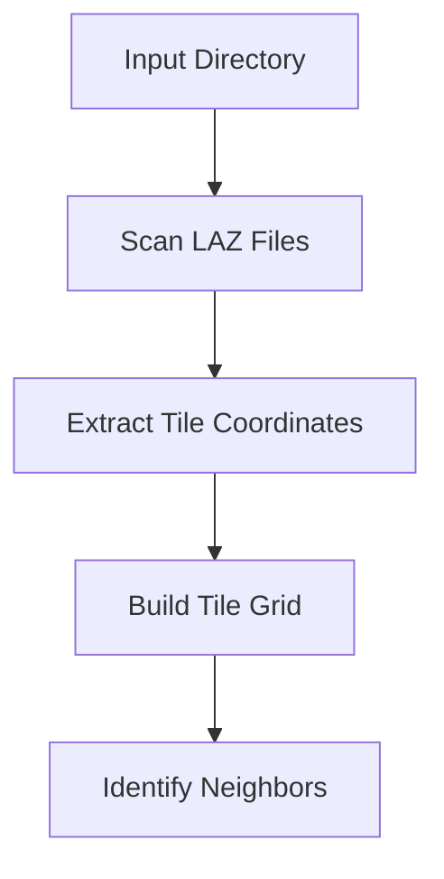

<!-- 🇫🇷 TRADUCTION FRANÇAISE REQUISE -->
<!-- Ce fichier est un modèle qui nécessite une traduction manuelle. -->
<!-- Veuillez traduire le contenu ci-dessous en conservant : -->
<!-- - Le frontmatter (métadonnées en haut) -->
<!-- - Les blocs de code (traduire uniquement les commentaires) -->
<!-- - Les liens et chemins de fichiers -->
<!-- - La structure Markdown -->


# Tile Stitching for Multi-Tile Datasets

Seamlessly combine multiple LiDAR tiles into unified training datasets with automatic neighbor detection and consistency management.

---

## 🎯 What is Tile Stitching?

**Tile stitching** enables processing multiple adjacent LiDAR tiles as a single cohesive dataset, automatically handling:

- Neighbor tile detection
- Coordinate system consistency
- Cross-tile patch sampling
- Metadata unification
- Dataset-level statistics

---

## 🚀 Quick Start

### Basic Stitching

```bash
# Process multiple tiles as unified dataset
ign-lidar-hd process \
  input_dir=data/raw/ \
  output_dir=output/ \
  stitching.enabled=true
```

### With Boundary-Aware Features

```bash
# Combine stitching with boundary-aware processing
ign-lidar-hd process \
  input_dir=data/raw/ \
  output_dir=output/ \
  stitching.enabled=true \
  features.boundary_aware=true \
  features.buffer_size=5.0
```

---

## 📊 How It Works

### 1. Tile Discovery



### 2. Neighbor Detection

The system automatically detects tile relationships:

```text
Tile Grid (1000m tiles):
┌─────┬─────┬─────┐
│ A-1 │ A-2 │ A-3 │  Tile naming: X_Y coordinates
├─────┼─────┼─────┤
│ B-1 │ B-2 │ B-3 │  Example: 1234_5678.laz
├─────┼─────┼─────┤
│ C-1 │ C-2 │ C-3 │
└─────┴─────┴─────┘

Each tile knows its 8 potential neighbors:
  N, S, E, W, NE, NW, SE, SW
```

### 3. Unified Processing

```python
# Unified dataset creation
1. Load all tiles in directory
2. Compute global statistics (mean, std, etc.)
3. Apply consistent normalization
4. Generate patches respecting tile boundaries
5. Create unified metadata
```

---

## ⚙️ Configuration

### Key Parameters

| Parameter                     | Type   | Default | Description                  |
| ----------------------------- | ------ | ------- | ---------------------------- |
| `stitching.enabled`           | bool   | `false` | Enable tile stitching        |
| `stitching.tile_size`         | float  | `1000`  | Expected tile size in meters |
| `stitching.overlap_tolerance` | float  | `10`    | Allowed overlap in meters    |
| `stitching.min_points`        | int    | `1000`  | Minimum points per tile      |
| `stitching.neighbor_search`   | string | `auto`  | Neighbor detection method    |

### Neighbor Search Methods

```bash
# Automatic detection (recommended)
stitching.neighbor_search=auto

# Grid-based (faster, assumes regular grid)
stitching.neighbor_search=grid

# Distance-based (flexible, handles irregular layouts)
stitching.neighbor_search=distance
```

---

## 📁 Output Structure

### Without Stitching (Default)

```text
output/
├── patches/
│   ├── tile_1234_5678/
│   │   ├── patch_0000.npy
│   │   ├── patch_0001.npy
│   │   └── ...
│   ├── tile_1234_5679/
│   │   ├── patch_0000.npy
│   │   └── ...
│   └── ...
└── metadata/
    ├── tile_1234_5678.json
    └── tile_1234_5679.json
```

### With Stitching (Unified)

```text
output/
├── patches/
│   ├── patch_0000.npy  ← All tiles combined
│   ├── patch_0001.npy
│   ├── ...
│   └── patch_9999.npy
├── metadata.json        ← Unified metadata
├── tile_index.json      ← Tile→patch mapping
└── stitching_info.json  ← Neighbor relationships
```

---

## 🎯 Use Cases

### 1. Regional Datasets

Process an entire region as one dataset:

```bash
# Download Paris city center
ign-lidar-hd download \
  bbox="2.3,48.85,2.4,48.9" \
  output_dir=data/paris/

# Process as unified dataset
ign-lidar-hd process \
  input_dir=data/paris/ \
  output_dir=output/paris_dataset/ \
  stitching.enabled=true \
  features=full
```

### 2. Building-Spanning Datasets

Handle buildings that span multiple tiles:

```bash
# Large building dataset
ign-lidar-hd process \
  input_dir=data/buildings/ \
  output_dir=output/buildings_dataset/ \
  stitching.enabled=true \
  features.boundary_aware=true \
  target_class=building
```

### 3. Continuous Landscapes

Process forests, coastlines, or other continuous features:

```bash
# Forest landscape
ign-lidar-hd process \
  input_dir=data/forest/ \
  output_dir=output/forest_dataset/ \
  stitching.enabled=true \
  features.boundary_aware=true \
  target_class=vegetation
```

---

## 🔧 Advanced Usage

### Python API

```python
from ign_lidar.core import TileStitcher
from ign_lidar.io import TileManager

# Initialize stitcher
stitcher = TileStitcher(
    tile_size=1000.0,
    overlap_tolerance=10.0,
    neighbor_search="auto"
)

# Load and analyze tiles
tile_manager = TileManager(input_dir="data/raw/")
tiles = tile_manager.load_all()

# Build tile grid
grid = stitcher.build_grid(tiles)
print(f"Grid: {grid.shape}, {len(tiles)} tiles")

# Get neighbors for a tile
tile = tiles[0]
neighbors = stitcher.get_neighbors(tile, grid)
print(f"Tile {tile.name} has {len(neighbors)} neighbors")

# Process with stitching
from ign_lidar.core import LiDARProcessor

processor = LiDARProcessor(
    stitching_enabled=True,
    boundary_aware=True
)
dataset = processor.process(tiles)
```

### Custom Tile Layouts

Handle non-standard tile arrangements:

```python
from ign_lidar.core import TileStitcher

# Define custom tile positions
tile_positions = {
    "tile_A": (0, 0),
    "tile_B": (1000, 0),
    "tile_C": (0, 1000),
    "tile_D": (1200, 500)  # Irregular position
}

# Create stitcher with custom layout
stitcher = TileStitcher(
    neighbor_search="distance",
    max_neighbor_distance=1500
)

grid = stitcher.build_grid_from_positions(tile_positions)
```

---

## 📈 Performance Considerations

### Memory Usage

```text
Memory = n_tiles × tile_memory + stitching_overhead

Example (10 tiles, 100MB each):
  Without stitching: 100 MB (1 tile at a time)
  With stitching:    1,200 MB (all tiles + overhead)
```

### Processing Time

| Mode             | Time | Memory | Output Quality |
| ---------------- | ---- | ------ | -------------- |
| No stitching     | 1.0x | Low    | Per-tile       |
| Stitching only   | 1.1x | Medium | Unified        |
| + Boundary-aware | 1.3x | High   | Best           |

### Optimization Strategies

```bash
# 1. Process in batches
stitching.batch_size=5  # Process 5 tiles at a time

# 2. Reduce buffer for boundary-aware
features.buffer_size=3.0  # Smaller buffer = less memory

# 3. Use grid-based neighbor search
stitching.neighbor_search=grid  # Faster for regular grids

# 4. Filter small tiles
stitching.min_points=5000  # Skip tiles with <5k points
```

---

## 📊 Stitching Metadata

### tile_index.json

Maps patches back to source tiles:

```json
{
  "patch_0000.npy": {
    "source_tiles": ["tile_1234_5678"],
    "bbox": [2.3, 48.85, 2.301, 48.851],
    "num_points": 2048
  },
  "patch_0001.npy": {
    "source_tiles": ["tile_1234_5678", "tile_1234_5679"],
    "bbox": [2.3005, 48.85, 2.3015, 48.851],
    "num_points": 2048,
    "crosses_boundary": true
  }
}
```

### stitching_info.json

Documents tile relationships:

```json
{
  "tiles": {
    "tile_1234_5678": {
      "neighbors": {
        "north": "tile_1234_5679",
        "east": "tile_1235_5678",
        "northeast": "tile_1235_5679"
      },
      "position": [1234000, 5678000],
      "num_points": 1234567
    }
  },
  "grid": {
    "shape": [3, 3],
    "tile_size": 1000.0,
    "total_tiles": 9
  }
}
```

---

## ✅ Best Practices

### Data Preparation

1. **Consistent naming**: Use standard IGN naming (X_Y.laz)
2. **Complete coverage**: Ensure no missing tiles in region
3. **Same CRS**: All tiles must use same coordinate system
4. **Same format**: Consistent LAZ version and point format

### Configuration

```bash
# Recommended for most cases
ign-lidar-hd process \
  input_dir=data/ \
  output_dir=output/ \
  stitching.enabled=true \
  stitching.neighbor_search=auto \
  features.boundary_aware=true \
  features.buffer_size=5.0
```

### Quality Checks

```python
# Verify stitching quality
import json

# Load stitching info
with open("output/stitching_info.json") as f:
    info = json.load(f)

# Check tile connectivity
for tile, data in info["tiles"].items():
    n_neighbors = len(data["neighbors"])
    print(f"{tile}: {n_neighbors} neighbors")

# Expected: Interior tiles have 8, edge tiles have 3-5
```

---

## 🐛 Troubleshooting

### Missing Neighbors

```bash
# Error: Expected neighbor not found
Solution: Check tile naming and coverage

# List tiles
ls -la data/raw/*.laz

# Expected pattern: tile_XXXX_YYYY.laz
```

### Memory Errors

```bash
# Out of memory error
Solution: Process in batches

stitching.batch_size=3  # Smaller batches
```

### Coordinate Mismatches

```bash
# Error: Tiles don't align
Solution: Verify CRS consistency

# Check CRS for all tiles
for f in data/raw/*.laz; do
  pdal info $f | grep "srs"
done
```

### Slow Processing

```bash
# Use grid-based search for regular layouts
stitching.neighbor_search=grid

# Or disable boundary-aware processing
features.boundary_aware=false
```

---

## 🎓 Complete Example

### Regional Building Classification

```bash
# 1. Download region
ign-lidar-hd download \
  bbox="2.35,48.86,2.37,48.88" \
  output_dir=data/le_marais/

# 2. Process with full stitching
ign-lidar-hd process \
  input_dir=data/le_marais/ \
  output_dir=output/le_marais_dataset/ \
  stitching.enabled=true \
  stitching.neighbor_search=auto \
  features.boundary_aware=true \
  features.buffer_size=5.0 \
  features=full \
  target_class=building \
  preprocess=aggressive

# 3. Verify output
ls -lh output/le_marais_dataset/patches/ | wc -l
cat output/le_marais_dataset/stitching_info.json | jq '.grid'

# 4. Train model on unified dataset
python train.py \
  --data output/le_marais_dataset/ \
  --architecture pointnet++ \
  --epochs 100
```

---

## 📚 Related Topics

- [Boundary-Aware Processing](/features/boundary-aware) - Cross-tile feature quality
- [Configuration System](/guides/configuration-system) - Advanced configuration
- [Complete Workflows](/guides/complete-workflow) - End-to-end examples

---

**Next Steps:**

- Try [Multi-Architecture Support](/features/multi-architecture)
- Explore [Python API](/api/core-module)
- Read [Performance Optimization](/guides/performance)
