# Vue d'ensemble de l'Accélération GPU

**Disponible dans :** v1.3.0+  
**Gain de Performance :** 5 à 10x plus rapide que le CPU  
**Prérequis :** GPU NVIDIA avec CUDA 11.0+

:::tip Statut du Développement GPU
🚧 **Amélioration Majeure GPU en Cours** - Nous implémentons une accélération GPU complète sur l'ensemble du pipeline. Consultez notre feuille de route détaillée dans la section "Développement Futur" ci-dessous pour les fonctionnalités à venir.
:::

## Vue d'ensemble

L'accélération GPU peut fournir une **accélération de 4 à 10x** pour le calcul des caractéristiques par rapport au traitement CPU, ce qui la rend essentielle pour les jeux de données LiDAR à grande échelle et les pipelines de production.

### Avantages

- ⚡ **4 à 10x plus rapide** pour le calcul des caractéristiques
- 🔄 **Basculement automatique vers CPU** lorsque le GPU n'est pas disponible
- 📦 **Aucune modification de code** requise - ajoutez simplement un flag
- 🎯 **Prêt pour la production** avec gestion d'erreurs complète
- 💾 **Efficacité mémoire** avec traitement par lots intelligent

:::tip Gains de Performance
L'accélération GPU est plus bénéfique pour les nuages de points avec >100K points. Pour les petits jeux de données, le traitement CPU peut être plus rapide en raison de la surcharge d'initialisation du GPU.
:::

## Prérequis

### Prérequis Matériel

- **GPU :** GPU NVIDIA avec support CUDA
- **Mémoire :** 4GB+ de RAM GPU recommandée (8GB+ pour les grandes tuiles)
- **Capacité de Calcul :** 3.5 ou supérieure

### Prérequis Logiciel

- **CUDA Toolkit :** 11.0 ou supérieur (11.8 ou 12.x recommandé)
- **Python :** 3.8 ou supérieur
- **Packages Python :** CuPy (requis), RAPIDS cuML (optionnel, meilleures performances)

### Modèles GPU Testés

| Modèle GPU  | Mémoire | Performance | Notes                    |
| ----------- | ------- | ----------- | ------------------------ |
| RTX 4090    | 24 GB   | Excellente  | Meilleures performances  |
| RTX 3080    | 10 GB   | Très Bonne  | Bon rapport qualité/prix |
| RTX 3060    | 12 GB   | Bonne       | Économique               |
| Tesla V100  | 16 GB   | Très Bonne  | Serveur/cloud            |
| GTX 1080 Ti | 11 GB   | Modérée     | Ancienne génération      |

## Installation

### Étape 1 : Vérifier la Disponibilité CUDA

Tout d'abord, vérifiez que vous avez un GPU NVIDIA et CUDA installé :

```bash
# Vérifier si vous avez un GPU NVIDIA
nvidia-smi

# Devrait afficher les informations de votre GPU et la version CUDA
```

Si `nvidia-smi` n'est pas trouvé, vous devez d'abord installer les pilotes NVIDIA et le CUDA Toolkit.

### Étape 2 : Installer le CUDA Toolkit

Visitez [NVIDIA CUDA Downloads](https://developer.nvidia.com/cuda-downloads) et suivez les instructions pour votre OS.

**Versions recommandées :**

- CUDA 11.8 (la plus compatible)
- CUDA 12.x (dernières fonctionnalités)

:::info Support WSL2
L'accélération GPU fonctionne sur WSL2 ! Prérequis :

- Windows 11 ou Windows 10 21H2+
- Pilotes NVIDIA installés sur Windows
- CUDA toolkit installé dans WSL2

Consultez le [guide WSL NVIDIA](https://docs.nvidia.com/cuda/wsl-user-guide/index.html) pour plus de détails.
:::

### Étape 3 : Installer les Dépendances Python GPU

:::warning Installation de CuPy
CuPy doit être installé séparément car il nécessite une version spécifique correspondant à votre CUDA Toolkit. L'installation via `pip install ign-lidar-hd[gpu]` **ne fonctionnera pas** car elle tenterait de compiler CuPy depuis les sources.
:::

```bash
# Option 1 : Support GPU basique avec CuPy (recommandé pour la plupart des utilisateurs)
pip install ign-lidar-hd
pip install cupy-cuda11x  # Pour CUDA 11.x
# OU
pip install cupy-cuda12x  # Pour CUDA 12.x

# Option 2 : GPU avancé avec RAPIDS cuML (meilleures performances)
pip install ign-lidar-hd
pip install cupy-cuda12x  # Choisir selon votre version CUDA
conda install -c rapidsai -c conda-forge -c nvidia cuml

# Option 3 : RAPIDS via pip (peut nécessiter plus de configuration)
pip install ign-lidar-hd
pip install cupy-cuda11x  # Pour CUDA 11.x
pip install cuml-cu11     # Pour CUDA 11.x
# OU
pip install cupy-cuda12x  # Pour CUDA 12.x
pip install cuml-cu12     # Pour CUDA 12.x
```

**Recommandations d'Installation :**

- **Installer CuPy séparément** : Toujours choisir `cupy-cuda11x` ou `cupy-cuda12x` selon votre version CUDA
- **CuPy uniquement** : Installation la plus simple, accélération de 5-6x
- **CuPy + RAPIDS** : Meilleures performances, jusqu'à 10x d'accélération
- **Conda pour RAPIDS** : Plus fiable pour les dépendances RAPIDS cuML

### Étape 4 : Vérifier l'Installation

```python
from ign_lidar.features_gpu import GPU_AVAILABLE, CUML_AVAILABLE

print(f"GPU (CuPy) available: {GPU_AVAILABLE}")
print(f"RAPIDS cuML available: {CUML_AVAILABLE}")
```

Sortie attendue :

```
GPU (CuPy) available: True
RAPIDS cuML available: True
```

## Démarrage Rapide

### Interface en Ligne de Commande

Ajoutez simplement le flag `--use-gpu` à n'importe quelle commande `enrich` :

```bash
# Utilisation basique
ign-lidar-hd enrich \
  --input tiles/ \
  --output enriched/ \
  --use-gpu

# Avec des options supplémentaires
ign-lidar-hd enrich \
  --input tiles/ \
  --output enriched/ \
  --use-gpu \
  --mode full \
  --num-workers 4
```

:::tip Basculement Automatique
Le flag `--use-gpu` basculera automatiquement vers le CPU si le GPU n'est pas disponible. Votre traitement continuera sans erreurs.
:::

### API Python

#### Utilisation de LiDARProcessor

```python
from pathlib import Path
from ign_lidar.processor import LiDARProcessor

# Créer un processeur avec accélération GPU
processor = LiDARProcessor(
    lod_level='LOD2',
    patch_size=150.0,
    num_points=16384,
    use_gpu=True  # ⚡ Activer le GPU
)

# Traiter les tuiles - accélération GPU automatique
num_patches = processor.process_tile(
    laz_file=Path("data/tiles/tile.laz"),
    output_dir=Path("data/patches")
)

print(f"Créé {num_patches} patches avec GPU")
```

#### Calcul Direct de Caractéristiques

```python
import numpy as np
from ign_lidar.features import compute_all_features_with_gpu

# Charger votre nuage de points
points = np.random.rand(1000000, 3).astype(np.float32)
classification = np.random.randint(0, 10, 1000000).astype(np.uint8)

# Calculer les caractéristiques avec GPU
normals, curvature, height, geo_features = compute_all_features_with_gpu(
    points=points,
    classification=classification,
    k=10,
    auto_k=False,
    use_gpu=True  # Active le GPU
)

print(f"Calculé {len(normals)} normales sur GPU")
```

## Configuration

### Configuration Python

```python
from ign_lidar import Config

config = Config(
    use_gpu=True,
    gpu_memory_limit=0.8,  # Utiliser 80% de la mémoire GPU
    cuda_device=0  # Utiliser le premier GPU (si plusieurs)
)
```

### Variables d'Environnement

```bash
# Spécifier le périphérique CUDA (si plusieurs GPUs)
export CUDA_VISIBLE_DEVICES=0

# Limiter l'utilisation de la mémoire GPU
export CUPY_GPU_MEMORY_LIMIT="8GB"
```

```python
import os

# Définir avant d'importer ign_lidar
os.environ['CUDA_VISIBLE_DEVICES'] = '0'

from ign_lidar.processor import LiDARProcessor
```

## Quand Utiliser le GPU

### ✅ Utiliser le GPU pour

- Grands nuages de points (>100K points)
- Traitement par lots de nombreuses tuiles
- Pipelines de production nécessitant de la vitesse
- Applications temps réel ou interactives
- Traitement de 10+ tuiles

### ❌ Utiliser le CPU pour

- Petits nuages de points (&lt;10K points)
- Tâches de traitement ponctuelles
- Systèmes sans GPU NVIDIA
- Prototypage et débogage
- Tests rapides avec 1-2 tuiles

### Arbre de Décision


## Benchmarks de Performance

### Accélérations Attendues

Basé sur des tests avec différents GPUs :

| Nombre de Points | CPU (12 cœurs) | GPU (RTX 3080) | Accélération |
| ---------------- | -------------- | -------------- | ------------ |
| 1K points        | 0.02s          | 0.01s          | 2x           |
| 10K points       | 0.15s          | 0.03s          | 5x           |
| 100K points      | 0.50s          | 0.08s          | 6.3x         |
| 1M points        | 4.5s           | 0.8s           | 5.6x         |
| 10M points       | 45s            | 8s             | 5.6x         |

**Facteurs affectant les performances :**

- Modèle GPU et mémoire
- Densité et distribution du nuage de points
- Paramètre K-neighbors (plus grand = plus de calcul)
- Référence CPU (plus de cœurs = accélération relative plus faible)

### Comparaison des Performances

```mermaid
xychart-beta
    title "Processing Speed Comparison (Tiles per Hour)"
    x-axis [Small Tiles, Medium Tiles, Large Tiles, Very Large Tiles]
    y-axis "Tiles per Hour" 0 --> 60
    bar "CPU (8 cores)" [12, 8, 4, 2]
    bar "GPU (RTX 3080)" [48, 32, 20, 12]
    bar "GPU (RTX 4090)" [60, 40, 28, 16]
```



### Benchmark de Votre Système

Utilisez le script de benchmark inclus pour tester les performances GPU vs CPU :

```bash
# Benchmark synthétique rapide
python scripts/benchmarks/benchmark_gpu.py --synthetic

# Benchmark avec des données réelles
python scripts/benchmarks/benchmark_gpu.py path/to/file.laz

# Benchmark complet multi-tailles
python scripts/benchmarks/benchmark_gpu.py --multi-size
```

## Meilleures Pratiques

### Optimisation des Performances GPU

1. **Traitement par lots** : Traiter plusieurs tuiles en séquence pour amortir la surcharge d'initialisation GPU
2. **K-neighbors approprié** : Plus grand k = plus de bénéfice de calcul du GPU
3. **Surveiller la mémoire** : Utiliser `nvidia-smi` pour vérifier l'utilisation de la mémoire GPU
4. **Utiliser workers=1 avec GPU** : Le GPU parallélise en interne, plusieurs workers peuvent rivaliser pour les ressources GPU

### Gestion des Erreurs

La bibliothèque gère les erreurs GPU avec élégance :

```python
# Basculement automatique vers CPU
processor = LiDARProcessor(use_gpu=True)

# Si le GPU échoue ou n'est pas disponible :
# - Avertissement enregistré
# - Utilise automatiquement le CPU
# - Le traitement continue avec succès
```

### Surveillance de l'Utilisation GPU

Surveiller l'utilisation du GPU pendant le traitement :

```bash
# Vérification ponctuelle
nvidia-smi

# Surveillance continue (mise à jour chaque seconde)
watch -n 1 nvidia-smi

# Surveillance en temps réel
nvidia-smi -l 1
```

## Dépannage

### "GPU requested but CuPy not available"

**Problème :** CuPy n'est pas installé ou incompatibilité de version CUDA.

**Solution :**

```bash
# Vérifier la version CUDA
nvidia-smi

# Installer la version CuPy correspondante
pip install cupy-cuda11x  # pour CUDA 11.x
pip install cupy-cuda12x  # pour CUDA 12.x
```

### Erreur "Out of memory"

**Problème :** Mémoire GPU insuffisante pour la taille du nuage de points.

**Solutions :**

1. Traiter les tuiles en plus petits lots
2. Réduire la taille des lots dans le calculateur GPU
3. Utiliser le CPU pour les très grandes tuiles

```python
# Réduire la taille des lots pour les grandes tuiles
from ign_lidar.features_gpu import GPUFeatureComputer

computer = GPUFeatureComputer(use_gpu=True, batch_size=50000)
```

### Performances lentes sur GPU

**Causes possibles :**

1. **GPU non utilisé** : Vérifier avec `nvidia-smi`
2. **Petits nuages de points** : La surcharge GPU domine (utiliser CPU pour &lt;10K points)
3. **Goulot d'étranglement de transfert mémoire** : Regrouper plusieurs opérations ensemble

**Solutions :**

```bash
# Surveiller l'utilisation GPU pendant le traitement
watch -n 1 nvidia-smi

# Utiliser le GPU uniquement pour les grands lots
# (géré automatiquement par la bibliothèque)
```

### Avertissements d'importation CuPy

**Problème :** Avertissements concernant la version CUDA ou les bibliothèques cuBLAS.

**Solution :** Généralement sans danger si les opérations se terminent avec succès. Pour supprimer :

```python
import warnings
warnings.filterwarnings('ignore', category=UserWarning, module='cupy')
```

### Arbre de Décision de Dépannage


## FAQ

### Q : Puis-je utiliser des GPUs AMD ?

**R :** Actuellement, seuls les GPUs NVIDIA avec CUDA sont supportés. Le support AMD ROCm pourrait être ajouté dans les versions futures.

### Q : Le GPU fonctionne-t-il sur WSL2 ?

**R :** Oui ! Le support CUDA dans WSL2 nécessite :

- Windows 11 ou Windows 10 21H2+
- Pilotes NVIDIA installés sur Windows
- CUDA toolkit installé dans WSL2

Voir le [guide WSL NVIDIA](https://docs.nvidia.com/cuda/wsl-user-guide/index.html)

### Q : Qu'en est-il de Google Colab / Kaggle ?

**R :** Oui, fonctionne parfaitement dans les notebooks cloud avec runtime GPU. Exemple :

```python
# Installer dans Colab
!pip install ign-lidar-hd[gpu]

# Utiliser le GPU (détecté automatiquement)
from ign_lidar.processor import LiDARProcessor
processor = LiDARProcessor(use_gpu=True)
```

### Q : Cela fonctionne-t-il avec TensorFlow/PyTorch ?

**R :** Oui, CuPy et TensorFlow/PyTorch peuvent coexister. Ils partagent la mémoire GPU. Surveillez l'utilisation pour éviter les erreurs OOM.

### Q : Puis-je mélanger le traitement CPU et GPU ?

**R :** Oui ! Utilisez `use_gpu=True` pour le calcul des caractéristiques mais les autres opérations (I/O, extraction de patches) restent sur CPU pour des performances optimales.

## Compatibilité des Versions

| ign-lidar-hd | CuPy  | CUDA        | Python |
| ------------ | ----- | ----------- | ------ |
| 1.5.0+       | 10.0+ | 11.0 - 12.x | 3.8+   |
| 1.3.0+       | 10.0+ | 11.0 - 12.x | 3.8+   |
| 1.2.1+       | 10.0+ | 11.0+       | 3.8+   |

## 🚀 Développement Futur

Nous développons continuellement les capacités d'accélération GPU :

### Phase 3 : Pipeline GPU Avancé (En Cours)

- **Traitement GPU Universel** : Accélération GPU du pipeline complet
- **Support Multi-GPU** : Traitement distribué sur plusieurs GPUs
- **Algorithmes Avancés** : Indexation spatiale et recherche de voisinage basées sur GPU
- **Optimisation Mémoire** : Pooling mémoire avancé et streaming
- **Analytique de Performance** : Surveillance des performances GPU en temps réel

**Calendrier Prévu :** Versions progressives tout au long de 2024-2025

### Fonctionnalités À Venir

- 🔄 **Pooling Mémoire GPU** : Réduire la surcharge d'allocation
- 📊 **Tableau de Bord Performance GPU** : Surveillance en temps réel
- 🌐 **Traitement Multi-GPU** : Traitement de tuiles en parallèle
- ⚡ **Traitement en Streaming** : Gérer des jeux de données plus grands que la mémoire GPU
- 🎯 **Sélection Auto-GPU** : Distribution intelligente des tâches GPU/CPU

:::info Restez Informé
Suivez notre [dépôt GitHub](https://github.com/sducournau/IGN_LIDAR_HD_DATASET) pour les derniers développements d'accélération GPU et annonces de versions.
:::

## Voir Aussi

- **[Fonctionnalités GPU](features.md)** - Calcul de caractéristiques détaillé et référence API
- **[Accélération RGB GPU](rgb-augmentation.md)** - Augmentation RGB accélérée par GPU (v1.5.0+)
- **[Architecture](../architecture.md)** - Architecture système
- **[Flux de Travail](../workflows.md)** - Exemples de flux de travail GPU

## Ressources Externes

- [CuPy: NumPy-compatible Array Library](https://cupy.dev/)
- [RAPIDS cuML: GPU-Accelerated Machine Learning](https://rapids.ai/)
- [NVIDIA CUDA Toolkit](https://developer.nvidia.com/cuda-toolkit)
- [RAPIDS cuML](https://rapids.ai/)
- [NVIDIA CUDA Toolkit](https://developer.nvidia.com/cuda-toolkit)
- [GPU-Accelerated Computing](https://www.nvidia.com/en-us/data-center/gpu-accelerated-applications/)
