# Aperçu de l'Accélération GPU

**Disponible depuis :** v1.3.0+  
**Performance :** 5-10x plus rapide que CPU  
**Requis :** GPU NVIDIA, CUDA 11.0+  
**Corrigé en v1.6.2 :** Formules GPU maintenant cohérentes avec CPU

:::warning Mise à Jour Importante v1.6.2
Les formules de caractéristiques GPU ont été corrigées en v1.6.2 pour correspondre au CPU et à la littérature standard. Si vous avez utilisé GPU en v1.6.1 ou antérieure, réentraînez vos modèles. [En savoir plus →](/docs/release-notes/v1.6.2)
:::

## Aperçu

L'accélération GPU peut fournir une **accélération de 4-10x** pour le calcul des caractéristiques par rapport au traitement CPU, ce qui la rend essentielle pour les grands jeux de données LiDAR et les pipelines de production.

### Avantages

- ⚡ **4-10x plus rapide** calcul des caractéristiques
- 🔄 **Repli automatique sur CPU** quand GPU indisponible
- 📦 **Aucun changement de code** requis - juste un flag
- 🎯 **Prêt pour la production** avec gestion complète des erreurs
- 💾 **Efficace en mémoire** avec traitement par lots intelligent

:::tip Gains de Performance
L'accélération GPU est plus bénéfique pour les nuages de points avec >100K points. Pour les petits datasets, le traitement CPU peut être plus rapide en raison de l'overhead d'initialisation GPU.
:::

## Prérequis

### Prérequis Matériels

- **GPU :** GPU NVIDIA avec support CUDA
- **Mémoire :** 4GB+ RAM GPU recommandée (8GB+ pour grandes dalles)
- **Capacité de Calcul :** 3.5 ou supérieur

### Prérequis Logiciels

- **CUDA Toolkit :** 11.0 ou supérieur (11.8 ou 12.x recommandé)
- **Python :** 3.8 ou supérieur
- **Packages Python :** CuPy (requis), RAPIDS cuML (optionnel, meilleures performances)

### Modèles GPU Testés

| Modèle GPU  | Mémoire | Performance | Notes                    |
| ----------- | ------- | ----------- | ------------------------ |
| RTX 4090    | 24 GB   | Excellente  | Meilleure performance    |
| RTX 3080    | 10 GB   | Très Bonne  | Bon rapport qualité/prix |
| RTX 3060    | 12 GB   | Bonne       | Économique               |
| Tesla V100  | 16 GB   | Très Bonne  | Serveur/cloud            |
| GTX 1080 Ti | 11 GB   | Modérée     | Ancienne génération      |

## Installation

### Step 1: Check CUDA Availability

First, verify you have an NVIDIA GPU and CUDA installed:

```bash
# Check if you have an NVIDIA GPU
nvidia-smi

# Should show your GPU info and CUDA version
```

If `nvidia-smi` is not found, you need to install NVIDIA drivers and CUDA Toolkit first.

### Step 2: Install CUDA Toolkit

Visit [NVIDIA CUDA Downloads](https://developer.nvidia.com/cuda-downloads) and follow instructions for your OS.

**Recommended versions:**

- CUDA 11.8 (most compatible)
- CUDA 12.x (latest features)

:::info WSL2 Support
GPU acceleration works on WSL2! Requirements:

- Windows 11 or Windows 10 21H2+
- NVIDIA drivers installed on Windows
- CUDA toolkit installed in WSL2

See [NVIDIA WSL guide](https://docs.nvidia.com/cuda/wsl-user-guide/index.html) for details.
:::

### Step 3: Install Python GPU Dependencies

```bash
# Option 1: Basic GPU support with CuPy (recommended for most users)
pip install ign-lidar-hd[gpu]

# Option 2: Advanced GPU with RAPIDS cuML (best performance)
pip install ign-lidar-hd[gpu-full]

# Option 3: RAPIDS via conda (recommended for RAPIDS cuML)
conda install -c rapidsai -c conda-forge -c nvidia cuml
pip install ign-lidar-hd[gpu]

# Option 4: Manual installation
# For CUDA 11.x
pip install cupy-cuda11x
pip install cuml-cu11  # Optional: RAPIDS cuML

# For CUDA 12.x
pip install cupy-cuda12x
pip install cuml-cu12  # Optional: RAPIDS cuML
```

**Installation Recommendations:**

- **CuPy only** (`[gpu]`): Easiest installation, 5-6x speedup
- **CuPy + RAPIDS** (`[gpu-full]`): Best performance, up to 10x speedup
- **Conda for RAPIDS**: More reliable for RAPIDS cuML dependencies

### Step 4: Verify Installation

```python
from ign_lidar.features_gpu import GPU_AVAILABLE, CUML_AVAILABLE

print(f"GPU (CuPy) available: {GPU_AVAILABLE}")
print(f"RAPIDS cuML available: {CUML_AVAILABLE}")
```

Expected output:

```
GPU (CuPy) available: True
RAPIDS cuML available: True
```

## Quick Start

### Command Line Interface

Simply add the `--use-gpu` flag to any `enrich` command:

```bash
# Basic usage
ign-lidar-hd enrich \
  --input tiles/ \
  --output enriched/ \
  --use-gpu

# With additional options
ign-lidar-hd enrich \
  --input tiles/ \
  --output enriched/ \
  --use-gpu \
  --mode building \
  --num-workers 4
```

:::tip Automatic Fallback
The `--use-gpu` flag will automatically fall back to CPU if GPU is not available. Your processing will continue without errors.
:::

### Python API

#### Using LiDARProcessor

```python
from pathlib import Path
from ign_lidar.processor import LiDARProcessor

# Create processor with GPU acceleration
processor = LiDARProcessor(
    lod_level='LOD2',
    patch_size=150.0,
    num_points=16384,
    use_gpu=True  # ⚡ Enable GPU
)

# Process tiles - automatic GPU acceleration
num_patches = processor.process_tile(
    laz_file=Path("data/tiles/tile.laz"),
    output_dir=Path("data/patches")
)

print(f"Created {num_patches} patches using GPU")
```

#### Direct Feature Computation

```python
import numpy as np
from ign_lidar.features import compute_all_features_with_gpu

# Load your point cloud
points = np.random.rand(1000000, 3).astype(np.float32)
classification = np.random.randint(0, 10, 1000000).astype(np.uint8)

# Compute features with GPU
normals, curvature, height, geo_features = compute_all_features_with_gpu(
    points=points,
    classification=classification,
    k=10,
    auto_k=False,
    use_gpu=True  # Enables GPU
)

print(f"Computed {len(normals)} normals on GPU")
```

## Configuration

### Python Configuration

```python
from ign_lidar import Config

config = Config(
    use_gpu=True,
    gpu_memory_limit=0.8,  # Use 80% of GPU memory
    cuda_device=0  # Use first GPU (if multiple)
)
```

### Environment Variables

```bash
# Specify CUDA device (if multiple GPUs)
export CUDA_VISIBLE_DEVICES=0

# Limit GPU memory usage
export CUPY_GPU_MEMORY_LIMIT="8GB"
```

```python
import os

# Set before importing ign_lidar
os.environ['CUDA_VISIBLE_DEVICES'] = '0'

from ign_lidar.processor import LiDARProcessor
```

## When to Use GPU

### ✅ Use GPU for:

- Large point clouds (>100K points)
- Batch processing of many tiles
- Production pipelines requiring speed
- Real-time or interactive applications
- Processing 10+ tiles

### ❌ Use CPU for:

- Small point clouds (<10K points)
- One-off processing tasks
- Systems without NVIDIA GPU
- Prototyping and debugging
- Quick tests with 1-2 tiles

### Decision Tree

```mermaid
flowchart TD
    Start([Need to Process LiDAR]) --> Size{Point Cloud Size}

    Size -->|< 10K points| UseCPU[Use CPU]
    Size -->|10K - 100K points| Consider{Batch Processing?}
    Size -->|> 100K points| UseGPU[Use GPU]

    Consider -->|Yes, many tiles| UseGPU
    Consider -->|No, 1-2 tiles| Either[Either CPU or GPU]

    UseGPU --> Check{GPU Available?}
    Check -->|Yes| GPUProcess[⚡ GPU Processing]
    Check -->|No| Fallback[Automatic CPU Fallback]

    UseCPU --> CPUProcess[CPU Processing]
    Either --> CPUProcess
    Fallback --> CPUProcess

    style GPUProcess fill:#e8f5e8
    style CPUProcess fill:#e3f2fd
    style Fallback fill:#fff3e0
```



## Performance Benchmarks

### Expected Speedups

Based on testing with various GPUs:

| Point Count | CPU (12 cores) | GPU (RTX 3080) | Speedup |
| ----------- | -------------- | -------------- | ------- |
| 1K points   | 0.02s          | 0.01s          | 2x      |
| 10K points  | 0.15s          | 0.03s          | 5x      |
| 100K points | 0.50s          | 0.08s          | 6.3x    |
| 1M points   | 4.5s           | 0.8s           | 5.6x    |
| 10M points  | 45s            | 8s             | 5.6x    |

**Factors affecting performance:**

- GPU model and memory
- Point cloud density and distribution
- K-neighbors parameter (larger = more computation)
- CPU baseline (more cores = smaller relative speedup)

### Performance Comparison


### Benchmarking Your System

Use the included benchmark script to test GPU vs CPU performance:

```bash
# Quick synthetic benchmark
python scripts/benchmarks/benchmark_gpu.py --synthetic

# Benchmark with real data
python scripts/benchmarks/benchmark_gpu.py path/to/file.laz

# Comprehensive multi-size benchmark
python scripts/benchmarks/benchmark_gpu.py --multi-size
```

## Best Practices

### Optimizing GPU Performance

1. **Batch processing**: Process multiple tiles in sequence to amortize GPU initialization overhead
2. **Appropriate k-neighbors**: Larger k = more computation benefit from GPU
3. **Monitor memory**: Use `nvidia-smi` to check GPU memory usage
4. **Use workers=1 with GPU**: GPU parallelizes internally, multiple workers may compete for GPU resources

### Error Handling

The library handles GPU errors gracefully:

```python
# Automatic CPU fallback
processor = LiDARProcessor(use_gpu=True)

# If GPU fails or unavailable:
# - Warning logged
# - Automatically uses CPU
# - Processing continues successfully
```

### Monitoring GPU Usage

Monitor GPU utilization during processing:

```bash
# One-time check
nvidia-smi

# Continuous monitoring (updates every second)
watch -n 1 nvidia-smi

# Real-time monitoring
nvidia-smi -l 1
```

## Troubleshooting

### "GPU requested but CuPy not available"

**Problem:** CuPy is not installed or CUDA version mismatch.

**Solution:**

```bash
# Check CUDA version
nvidia-smi

# Install matching CuPy version
pip install cupy-cuda11x  # for CUDA 11.x
pip install cupy-cuda12x  # for CUDA 12.x
```

### "Out of memory" error

**Problem:** GPU memory insufficient for point cloud size.

**Solutions:**

1. Process tiles in smaller batches
2. Reduce batch size in GPU computer
3. Use CPU for very large tiles

```python
# Reduce batch size for large tiles
from ign_lidar.features_gpu import GPUFeatureComputer

computer = GPUFeatureComputer(use_gpu=True, batch_size=50000)
```

### Slow performance on GPU

**Possible causes:**

1. **GPU not utilized**: Check with `nvidia-smi`
2. **Small point clouds**: GPU overhead dominates (use CPU for <10K points)
3. **Memory transfer bottleneck**: Batch multiple operations together

**Solutions:**

```bash
# Monitor GPU usage while processing
watch -n 1 nvidia-smi

# Use GPU for large batches only
# (automatically handled by the library)
```

### CuPy import warnings

**Problem:** Warnings about CUDA version or cuBLAS libraries.

**Solution:** Usually safe to ignore if operations complete successfully. To suppress:

```python
import warnings
warnings.filterwarnings('ignore', category=UserWarning, module='cupy')
```

### Troubleshooting Decision Tree

```mermaid
flowchart TD
    Start([GPU Issues?]) --> Check1{CUDA Available?}

    Check1 -->|No| Install[Install CUDA Toolkit<br/>+ GPU Drivers]
    Check1 -->|Yes| Check2{Out of Memory?}

    Install --> Restart[Restart System]
    Restart --> Check1

    Check2 -->|Yes| MemFix[Reduce Memory Usage]
    Check2 -->|No| Check3{Slow Performance?}

    MemFix --> MemOptions[• Lower gpu_memory_limit<br/>• Reduce batch_size<br/>• Use smaller tiles]
    MemOptions --> Test1[Test Again]

    Check3 -->|Yes| PerfFix[Optimize Settings]
    Check3 -->|No| Check4{Driver Issues?}

    PerfFix --> PerfOptions[• Update GPU drivers<br/>• Check GPU utilization<br/>• Verify CUDA version]
    PerfOptions --> Test2[Test Again]

    Check4 -->|Yes| DriverFix[Update Drivers]
    Check4 -->|No| Success[GPU Working]

    DriverFix --> Test3[Test Again]
    Test1 --> Success
    Test2 --> Success
    Test3 --> Success

    style Start fill:#e3f2fd
    style Success fill:#e8f5e8
    style Install fill:#fff3e0
    style MemFix fill:#fff3e0
    style PerfFix fill:#fff3e0
    style DriverFix fill:#fff3e0
```



## FAQ

### Q: Can I use AMD GPUs?

**A:** Currently only NVIDIA GPUs with CUDA are supported. AMD ROCm support may be added in future versions.

### Q: Does GPU work on WSL2?

**A:** Yes! CUDA support in WSL2 requires:

- Windows 11 or Windows 10 21H2+
- NVIDIA drivers installed on Windows
- CUDA toolkit installed in WSL2

See [NVIDIA WSL guide](https://docs.nvidia.com/cuda/wsl-user-guide/index.html)

### Q: What about Google Colab / Kaggle?

**A:** Yes, works great in cloud notebooks with GPU runtime. Example:

```python
# Install in Colab
!pip install ign-lidar-hd[gpu]

# Use GPU (automatically detected)
from ign_lidar.processor import LiDARProcessor
processor = LiDARProcessor(use_gpu=True)
```

### Q: Does this work with TensorFlow/PyTorch?

**A:** Yes, CuPy and TensorFlow/PyTorch can coexist. They share GPU memory. Monitor usage to avoid OOM errors.

### Q: Can I mix CPU and GPU processing?

**A:** Yes! Use `use_gpu=True` for feature computation but other operations (I/O, patch extraction) remain on CPU for optimal performance.

## Version Compatibility

| ign-lidar-hd | CuPy  | CUDA        | Python |
| ------------ | ----- | ----------- | ------ |
| 1.5.0+       | 10.0+ | 11.0 - 12.x | 3.8+   |
| 1.3.0+       | 10.0+ | 11.0 - 12.x | 3.8+   |
| 1.2.1+       | 10.0+ | 11.0+       | 3.8+   |

## See Also

- **[GPU Features](features.md)** - Detailed feature computation and API reference
- **[RGB GPU Acceleration](rgb-augmentation.md)** - GPU-accelerated RGB augmentation (v1.5.0+)
- **[Architecture](../architecture.md)** - System architecture
- **[Workflows](../workflows.md)** - GPU workflow examples

## External Resources

- [CuPy: NumPy-compatible Array Library](https://cupy.dev/)
- [RAPIDS cuML](https://rapids.ai/)
- [NVIDIA CUDA Toolkit](https://developer.nvidia.com/cuda-toolkit)
- [GPU-Accelerated Computing](https://www.nvidia.com/en-us/data-center/gpu-accelerated-applications/)
