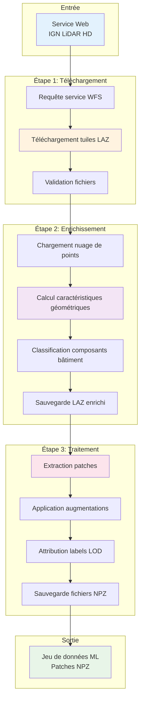

Ce guide couvre les workflows essentiels pour traiter les données IGN LiDAR HD en jeux de données prêts pour l'apprentissage automatique.

## Vue d'ensemble

Le workflow de traitement IGN LiDAR HD consiste en trois étapes principales :

1. **Téléchargement** - Obtenir les tuiles LiDAR depuis les serveurs IGN
2. **Enrichissement** - Ajouter des caractéristiques de composants de bâtiment aux points
3. **Traitement** - Extraire des patches pour l'apprentissage automatique

### 🔄 Pipeline complet du workflow



## Étape 1 : Télécharger les tuiles LiDAR

Téléchargez les tuiles LiDAR pour votre zone d'intérêt :

```bash
# Télécharger les tuiles pour le centre de Paris
ign-lidar-hd download \
  --bbox 2.25,48.82,2.42,48.90 \
  --output /chemin/vers/tuiles_brutes/ \
  --max-tiles 10
```

### Paramètres

- `--bbox` : Boîte englobante au format `min_lon,min_lat,max_lon,max_lat`
- `--output` : Répertoire pour sauvegarder les tuiles téléchargées
- `--max-tiles` : Nombre maximum de tuiles à télécharger (optionnel)

### Sortie

Les tuiles téléchargées sont sauvegardées en tant que fichiers LAZ :

```text
tuiles_brutes/
├── LIDARHD_FXX_0123_4567_LA93_IGN69_2020.laz
├── LIDARHD_FXX_0124_4567_LA93_IGN69_2020.laz
└── ...
```

## Étape 2 : Enrichir avec des caractéristiques de bâtiment

Ajoutez des caractéristiques de classification des composants de bâtiment aux nuages de points :

```bash
# Enrichir les tuiles avec toutes les caractéristiques
ign-lidar-hd enrich \
  --input-dir /chemin/vers/tuiles_brutes/ \
  --output /chemin/vers/tuiles_enrichies/ \
  --mode full \
  --num-workers 4
```

### Paramètres enrichissement

- `--input-dir` : Répertoire contenant les tuiles LAZ brutes
- `--output` : Répertoire pour sauvegarder les tuiles enrichies
- `--mode` : Mode d'extraction de caractéristiques (`core` ou `full`)
- `--num-workers` : Nombre de workers parallèles (optionnel)

## Étape 3 : Extraire des patches pour l'apprentissage automatique

Créez des patches d'entraînement depuis les tuiles enrichies :

```bash
# Extraire des patches d'entraînement
ign-lidar-hd process \
  --input-dir /chemin/vers/tuiles_enrichies/ \
  --output /chemin/vers/patches/ \
  --lod-level LOD2 \
  --patch-size 16000
```

### Paramètres traitement

- `--input-dir` : Répertoire contenant les tuiles LAZ enrichies
- `--output` : Répertoire pour sauvegarder les patches NPZ
- `--lod-level` : Niveau de détail (LOD2 ou LOD3)
- `--patch-size` : Nombre de points par patch

## Exemple complet

Voici un exemple complet de workflow :

```python
from ign_lidar import LiDARProcessor
import os

# Configuration
bbox = (2.25, 48.82, 2.42, 48.90)  # Centre de Paris
raw_dir = "data/raw/"
enriched_dir = "data/enriched/"
patches_dir = "data/patches/"

# Étape 1: Initialiser le processeur
processor = LiDARProcessor(
    lod_level="LOD2",
    num_workers=4
)

# Étape 2: Télécharger les données
processor.download(
    bbox=bbox,
    output_dir=raw_dir,
    max_tiles=10
)

# Étape 3: Enrichir avec des caractéristiques
processor.enrich_directory(
    input_dir=raw_dir,
    output_dir=enriched_dir
)

# Étape 4: Extraire les patches
patches = processor.process_directory(
    input_dir=enriched_dir,
    output_dir=patches_dir
)

print(f"Traitement terminé ! {len(patches)} patches créés.")
```

## Prochaines étapes

- Explorez les [Commandes CLI avancées](cli-commands.md)
- En savoir plus sur l'[Intégration QGIS](qgis-integration.md)
- Découvrez les [Fonctionnalités de saut intelligent](../features/smart-skip.md)
