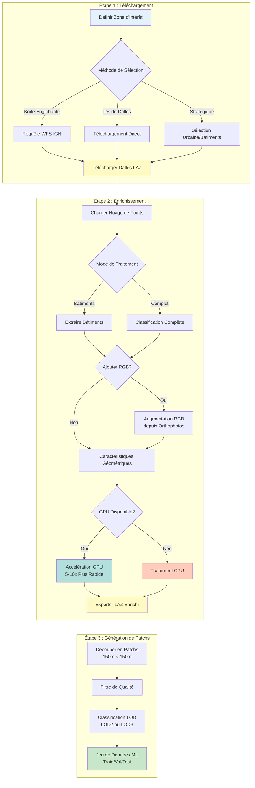

# Guide de Workflow Complet

Ce guide vous accompagne dans le processus complet de transformation des données brutes LiDAR HD de l'IGN en jeux de données prêts pour l'apprentissage automatique.

## 📋 Vue d'Ensemble

Le workflow complet se compose de trois étapes principales :

1. **Téléchargement** - Acquérir les dalles LiDAR depuis les serveurs de l'IGN
2. **Enrichissement** - Ajouter des caractéristiques géométriques et des données RGB optionnelles
3. **Patchs** - Créer des patchs prêts à l'entraînement pour les modèles ML



## 🎯 Prérequis

### Obligatoires

- Python 3.8 ou supérieur
- Package `ign-lidar-hd` installé
- Connexion Internet (pour télécharger les dalles)
- ~10 Go d'espace disque libre par 10 dalles

### Optionnels

- GPU NVIDIA avec support CUDA (pour accélération 5-10x)
- Orthophotos IGN BD ORTHO® (pour augmentation RGB)

## 🚀 Méthode 1 : Configuration Pipeline (Recommandée)

La façon la plus simple d'exécuter un workflow complet est d'utiliser des fichiers de configuration YAML.

### Étape 1 : Créer un Fichier de Configuration

```bash
ign-lidar-hd pipeline config.yaml --create-example full
```

Ceci crée un fichier `config.yaml` avec toutes les options :

```yaml
# config.yaml - Configuration Pipeline Complète
global:
  num_workers: 4 # Threads de traitement parallèle
  verbose: true # Journalisation détaillée

download:
  # Boîte englobante : longitude_min, latitude_min, longitude_max, latitude_max
  bbox: "2.3, 48.8, 2.4, 48.9" # Zone de Paris
  output: "data/raw"
  max_tiles: 10
  tile_selection_strategy: "urban" # ou "building_rich", "random"

enrich:
  input_dir: "data/raw"
  output: "data/enriched"
  mode: "full" # Focus sur toutes les caractéristiques

  # Augmentation RGB (optionnel)
  add_rgb: true
  rgb_source: "ign_orthophoto"
  rgb_cache_dir: "cache/orthophotos"

  # Accélération GPU (optionnel)
  use_gpu: true # Repli automatique sur CPU si GPU indisponible

  # Extraction de Caractéristiques
  compute_normals: true
  compute_curvature: true
  neighborhood_size: 20

patch:
  input_dir: "data/enriched"
  output: "data/patches"
  lod_level: "LOD2" # ou "LOD3"
  num_points: 16384
  patch_size: 150 # mètres
  overlap: 0.1 # 10% de chevauchement

  # Contrôle Qualité
  min_building_points: 1000
  filter_empty_patches: true
```

### Étape 2 : Exécuter le Pipeline Complet

```bash
ign-lidar-hd pipeline config.yaml
```

Le pipeline va :

1. ✅ Télécharger les dalles depuis l'IGN
2. ✅ Enrichir avec des caractéristiques et RGB optionnel
3. ✅ Créer des patchs d'entraînement
4. ✅ Sauvegarder les métadonnées et statistiques

**Structure de Sortie :**

```text
project/
├── config.yaml
├── data/
│   ├── raw/           # Dalles téléchargées
│   ├── enriched/      # Dalles enrichies de caractéristiques
│   └── patches/       # Patchs prêts pour ML
│       ├── LOD2/
│       │   ├── train/
│       │   ├── val/
│       │   └── test/
│       └── metadata.json
└── cache/
    └── orthophotos/   # Données RGB en cache
```

### Étape 3 : Vérifier les Résultats

```python
from pathlib import Path
import json

# Charger les métadonnées
metadata = json.loads(Path("data/patches/metadata.json").read_text())

print(f"Total de patchs : {metadata['total_patches']}")
print(f"Classes : {metadata['classes']}")
print(f"Caractéristiques : {metadata['features']}")
```

## 🛠️ Méthode 2 : Ligne de Commande Étape par Étape

Pour plus de contrôle, exécutez chaque étape séparément.

### Étape 1 : Télécharger les Dalles

```bash
# Télécharger par boîte englobante (zone de Paris)
ign-lidar-hd download \
  --bbox 2.3,48.8,2.4,48.9 \
  --output data/raw \
  --max-tiles 10 \
  --strategy urban

# Ou télécharger des dalles spécifiques
ign-lidar-hd download \
  --tiles 0750_6620 0750_6621 0750_6622 \
  --output data/raw
```

**Options :**

- `--bbox` : Boîte englobante géographique (lon_min, lat_min, lon_max, lat_max)
- `--max-tiles` : Limiter le nombre de dalles à télécharger
- `--strategy` : Stratégie de sélection de dalles (urban/building_rich/random)
- `--tiles` : IDs de dalles spécifiques à télécharger

### Étape 2 : Enrichir avec des Caractéristiques

```bash
# Enrichissement basique (CPU uniquement)
ign-lidar-hd enrich \
  --input-dir data/raw \
  --output data/enriched \
  --num-workers 4

# Avec accélération GPU
ign-lidar-hd enrich \
  --input-dir data/raw \
  --output data/enriched \
  --use-gpu \
  --num-workers 2

# Avec augmentation RGB
ign-lidar-hd enrich \
  --input-dir data/raw \
  --output data/enriched \
  --add-rgb \
  --rgb-cache-dir cache/orthophotos \
  --num-workers 4
```

**Options :**

- `--use-gpu` : Activer l'accélération GPU (nécessite CUDA)
- `--add-rgb` : Ajouter des couleurs RGB depuis les orthophotos IGN
- `--rgb-cache-dir` : Répertoire de cache pour les dalles d'orthophotos
- `--num-workers` : Nombre de workers parallèles

### Étape 3 : Créer des Patchs

```bash
# Créer des patchs LOD2 (15 classes)
ign-lidar-hd patch \
  --input-dir data/enriched \
  --output data/patches \
  --lod-level LOD2 \
  --num-points 16384

# Créer des patchs LOD3 (30+ classes)
ign-lidar-hd patch \
  --input-dir data/enriched \
  --output data/patches \
  --lod-level LOD3 \
  --num-points 32768
```

**Options :**

- `--lod-level` : LOD2 (15 classes) ou LOD3 (30+ classes)
- `--num-points` : Points par patch (typiquement 8192-32768)

## 🐍 Méthode 3 : API Python

Pour une flexibilité maximale, utilisez directement l'API Python.

### Script de Workflow Complet

```python
from ign_lidar import LiDARProcessor, TileDownloader, PatchGenerator
from pathlib import Path

# Configuration
bbox = (2.3, 48.8, 2.4, 48.9)  # Zone de Paris
raw_dir = Path("data/raw")
enriched_dir = Path("data/enriched")
patches_dir = Path("data/patches")

# Étape 1 : Télécharger les Dalles
print("📥 Téléchargement des dalles...")
downloader = TileDownloader(output_dir=raw_dir)
tiles = downloader.download_bbox(
    bbox=bbox,
    max_tiles=10,
    strategy="urban"
)
print(f"✅ {len(tiles)} dalles téléchargées")

# Étape 2 : Enrichir avec des Caractéristiques
print("⚡ Enrichissement avec des caractéristiques...")
processor = LiDARProcessor(
    use_gpu=True,           # Activer le GPU si disponible
    include_rgb=True,       # Ajouter les couleurs RGB
    rgb_cache_dir=Path("cache/orthophotos"),
    num_workers=4
)

enriched_files = []
for tile_path in raw_dir.glob("*.laz"):
    output_path = enriched_dir / tile_path.name
    processor.enrich(tile_path, output_path)
    enriched_files.append(output_path)
    print(f"  ✓ {tile_path.name}")

print(f"✅ {len(enriched_files)} fichiers enrichis")

# Étape 3 : Créer des Patchs
print("📦 Création de patchs...")
generator = PatchGenerator(
    lod_level="LOD2",
    num_points=16384
)

patches = generator.generate_from_directory(
    enriched_dir,
    patches_dir
)
print(f"✅ {len(patches)} patchs générés")

# Résumé
print("\n📊 Résumé :")
print(f"  Dalles brutes : {len(tiles)}")
print(f"  Fichiers enrichis : {len(enriched_files)}")
print(f"  Patchs d'entraînement : {len(patches)}")
```

### Avancé : Extraction de Caractéristiques Personnalisée

```python
from ign_lidar import LiDARProcessor
import numpy as np

# Processeur personnalisé avec caractéristiques spécifiques
processor = LiDARProcessor(
    lod_level="LOD2",
    use_gpu=True,
    features={
        "normals": True,
        "curvature": True,
        "planarity": True,
        "verticality": True,
        "density": True,
        "architectural_style": True
    },
    neighborhood_size=20,  # k plus proches voisins
    min_building_height=3.0  # mètres
)

# Traiter avec filtrage personnalisé
def custom_filter(points):
    """Conserver uniquement les points de haute qualité"""
    # Supprimer les points isolés
    from scipy.spatial import cKDTree
    tree = cKDTree(points[:, :3])
    distances, _ = tree.query(points[:, :3], k=10)
    mask = distances.mean(axis=1) < 2.0  # Seuil de 2m
    return points[mask]

# Appliquer le traitement
enriched = processor.enrich(
    input_path="data/raw/tile.laz",
    output_path="data/enriched/tile.laz",
    preprocess_fn=custom_filter
)
```

## 📊 Surveillance de la Progression

### Surveillance en Temps Réel

```python
from ign_lidar import LiDARProcessor
from tqdm import tqdm

processor = LiDARProcessor()

# Barre de progression pour traitement par lots
files = list(Path("data/raw").glob("*.laz"))
for file_path in tqdm(files, desc="Traitement des dalles"):
    processor.enrich(file_path, Path("data/enriched") / file_path.name)
```

### Surveillance des Ressources

```python
import psutil
import time

def monitor_resources():
    """Surveiller l'utilisation du CPU et de la mémoire"""
    process = psutil.Process()

    while True:
        cpu_percent = process.cpu_percent(interval=1)
        memory_mb = process.memory_info().rss / 1024 / 1024
        print(f"CPU : {cpu_percent:.1f}% | Mémoire : {memory_mb:.0f} Mo")
        time.sleep(5)

# Exécuter dans un thread séparé
import threading
monitor_thread = threading.Thread(target=monitor_resources, daemon=True)
monitor_thread.start()

# Votre code de traitement ici
processor.process_directory("data/raw", "data/enriched")
```

## 🔧 Dépannage

### Problèmes Courants

#### 1. Mémoire Insuffisante

**Solution :** Utiliser le traitement par morceaux ou réduire la taille des lots :

```python
processor = LiDARProcessor(
    chunk_size=1_000_000,  # Traiter 1M de points à la fois
    num_workers=2          # Réduire les workers parallèles
)
```

#### 2. GPU Non Détecté

**Solution :** Vérifier l'installation de CUDA :

```bash
# Vérifier la version de CUDA
nvidia-smi

# Tester CuPy
python -c "import cupy; print(cupy.cuda.runtime.getDeviceCount())"
```

Si le GPU n'est pas disponible, la bibliothèque revient automatiquement au traitement CPU.

#### 3. L'Augmentation RGB Échoue

**Solution :** S'assurer que les orthophotos sont accessibles :

```python
from ign_lidar.rgb_augmentation import verify_rgb_source

# Tester la source RGB
result = verify_rgb_source(
    test_tile="0750_6620",
    cache_dir=Path("cache/orthophotos")
)
print(f"Source RGB valide : {result}")
```

#### 4. Traitement Lent

**Solution :** Activer les optimisations :

```python
processor = LiDARProcessor(
    use_gpu=True,           # Activer le GPU
    num_workers=8,          # Workers parallèles max
    cache_features=True,    # Mettre en cache les résultats intermédiaires
    skip_existing=True      # Sauter les fichiers déjà traités
)
```

## 📈 Conseils de Performance

### 1. Nombre Optimal de Workers

```python
import os

# Utiliser 75% des cœurs CPU pour les tâches liées aux E/S
optimal_workers = max(1, int(os.cpu_count() * 0.75))

processor = LiDARProcessor(num_workers=optimal_workers)
```

### 2. Traitement par Lots GPU

```python
# Traiter plusieurs dalles sur GPU pour une meilleure utilisation
processor = LiDARProcessor(
    use_gpu=True,
    gpu_batch_size=4  # Traiter 4 dalles simultanément
)
```

### 3. Optimisation des E/S Disque

```bash
# Utiliser SSD pour le stockage intermédiaire
export TMPDIR=/mnt/ssd/tmp

# Ou en Python
import tempfile
tempfile.tempdir = "/mnt/ssd/tmp"
```

## 🎓 Prochaines Étapes

- 📊 [Analyser les patchs générés](../reference/dataset-analysis)
- 🧪 [Entraîner des modèles ML](../examples/training-models)
- 🎨 [Visualiser les résultats](../guides/visualization)
- ⚡ [Guide d'optimisation GPU](../gpu/optimization)

## 📚 Lectures Complémentaires

- [Référence Configuration Pipeline](../reference/pipeline-config)
- [Détails Extraction de Caractéristiques](../features/geometric-features)
- [Guide Augmentation RGB](../features/rgb-augmentation)
- [Benchmarks de Performance](../reference/benchmarks)
