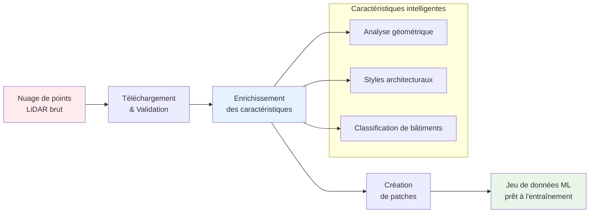

## 🎉 Annonce de la Première Version

**Nous sommes ravis d'annoncer la première version officielle de la Bibliothèque de Traitement LiDAR HD de l'IGN !**

📺 **[Regardez notre vidéo de lancement](https://youtu.be/ksBWEhkVqQI)** pour voir la bibliothèque en action !

📖 **[Lisez l'annonce complète de la version](/blog/first-release)** sur notre blog !

---

## Pour Commencer

Bienvenue dans la documentation de la **Bibliothèque de Traitement LiDAR HD de l'IGN** !

Transformez les données LiDAR françaises en jeux de données prêts pour l'apprentissage automatique pour la classification des bâtiments avec cette boîte à outils Python complète. 🏗️

:::tip Pourquoi utiliser cette bibliothèque ?

- **🎯 Spécialisée pour le LiDAR français** : Optimisée pour le format LiDAR HD de l'IGN et les standards de classification
- **⚡ Prête pour la production** : Testée en conditions réelles avec le traitement de plus de 50 dalles et une gestion complète des erreurs
- **🚀 Accélération GPU** : Support CUDA optionnel pour un calcul plus rapide des caractéristiques
- **📦 Pipeline complet** : Du téléchargement brut aux patchs prêts pour l'entraînement en un seul flux de travail
  :::

## Qu'est-ce que le LiDAR HD de l'IGN ?

La Bibliothèque de Traitement LiDAR HD de l'IGN est une boîte à outils Python complète pour le traitement de données LiDAR haute densité de l'Institut national de l'information géographique et forestière (IGN). Elle transforme les nuages de points bruts en jeux de données prêts pour l'apprentissage automatique, spécifiquement conçus pour les tâches de **classification du Niveau de Détail (LOD) des bâtiments**.


Cette bibliothèque permet aux chercheurs et développeurs de :

- **Télécharger** les dalles LiDAR directement depuis les serveurs de l'IGN
- **Enrichir** les nuages de points avec des caractéristiques géométriques et architecturales avancées
- **Générer** des patchs d'entraînement pour les modèles d'apprentissage profond
- **Classifier** les composants des bâtiments aux niveaux LOD2 (15 classes) et LOD3 (plus de 30 classes)

## 🔄 Aperçu du pipeline de traitement



## Caractéristiques principales

- 🎯 **Traitement LiDAR uniquement** - Aucune dépendance RGB requise
- 🎨 **Augmentation RGB** - Enrichissement couleur optionnel depuis les orthophotos IGN (NOUVEAU !)
- ⚡ **Détection intelligente de saut** - Reprendre les workflows interrompus
- 🏗️ **Classification multi-niveaux** - Support LOD2 et LOD3
- 🚀 **Accélération GPU** - Support CUDA optionnel
- 🔄 **Traitement parallèle** - Traitement par lots multi-worker
- 📊 **Caractéristiques riches** - Extraction complète de caractéristiques géométriques

## Installation rapide

```bash
pip install ign-lidar-hd
```

## Exemple rapide

```python
from ign_lidar import LiDARProcessor
from pathlib import Path

# Initialiser le processeur
processor = LiDARProcessor(lod_level="LOD2")

# Traiter une seule tuile
patches = processor.process_tile("data.laz", "output/")

# NOUVEAU : Traiter avec augmentation RGB depuis les orthophotos IGN
processor_rgb = LiDARProcessor(
    lod_level="LOD2",
    include_rgb=True,
    rgb_cache_dir=Path("cache/")
)
patches_rgb = processor_rgb.process_tile("data.laz", "output/")
print(f"Généré {len(patches_rgb)} patches avec couleurs RGB !")
```

## Prochaines étapes

- 📖 Lire le [Guide d'installation](installation/quick-start.md)
- 🎓 Suivre le [Guide d'utilisation de base](guides/basic-usage.md)
- 🎨 **NOUVEAU :** Découvrir l'[Augmentation RGB](features/rgb-augmentation.md)
- 🔍 Explorer les [Fonctionnalités de saut intelligent](features/smart-skip.md)
- 📚 Consulter le [Guide d'optimisation mémoire](reference/memory-optimization.md)

## Statut du projet

Cette bibliothèque est activement maintenue et utilisée pour traiter les données IGN LiDAR HD pour la recherche en classification des composants de bâtiment. Elle supporte :

- **Classification LOD2** : 15 classes de composants de bâtiment
- **Classification LOD3** : 30 classes détaillées de composants de bâtiment
- **Ingénierie des caractéristiques** : 30+ caractéristiques géométriques par point
- **Formats de données** : LAZ 1.4, patches NPZ, sorties compatibles QGIS

## Obtenir de l'aide

- 📋 Consulter la [Référence rapide](https://github.com/sducournau/IGN_LIDAR_HD_DATASET/blob/main/QUICK_REFERENCE.md)
- 🐛 Signaler des problèmes sur [GitHub Issues](https://github.com/sducournau/IGN_LIDAR_HD_DATASET/issues)
- 💬 Poser des questions dans [GitHub Discussions](https://github.com/sducournau/IGN_LIDAR_HD_DATASET/discussions)
