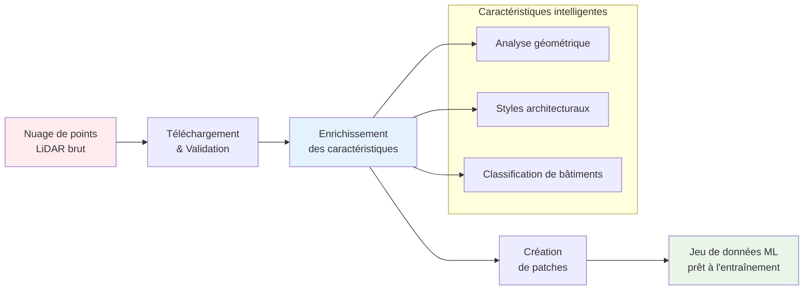

# Commencer

Bienvenue dans la documentation de la bibliothèque de traitement IGN LiDAR HD !

## Qu'est-ce qu'IGN LiDAR HD ?

La bibliothèque de traitement IGN LiDAR HD est une boîte à outils Python pour traiter les données LiDAR haute densité de l'Institut national de l'information géographique et forestière (IGN) en jeux de données prêts pour l'apprentissage automatique.

## 🔄 Aperçu du pipeline de traitement



## Caractéristiques principales

- 🎯 **Traitement LiDAR uniquement** - Aucune dépendance RGB
- ⚡ **Détection intelligente de saut** - Reprendre les workflows interrompus
- 🏗️ **Classification multi-niveaux** - Support LOD2 et LOD3
- 🚀 **Accélération GPU** - Support CUDA optionnel
- 🔄 **Traitement parallèle** - Traitement par lots multi-worker
- 📊 **Caractéristiques riches** - Extraction complète de caractéristiques géométriques

## Installation rapide

```bash
pip install ign-lidar-hd
```

## Exemple rapide

```python
from ign_lidar import LiDARProcessor

# Initialiser le processeur
processor = LiDARProcessor(lod_level="LOD2")

# Traiter une seule tuile
patches = processor.process_tile("data.laz", "output/")
```

## Prochaines étapes

- 📖 Lire le [Guide d'installation](installation/quick-start.md)
- 🎓 Suivre le [Guide d'utilisation de base](guides/basic-usage.md)
- 🔍 Explorer les [Fonctionnalités de saut intelligent](features/smart-skip.md)
- 📚 Consulter le [Guide d'optimisation mémoire](reference/memory-optimization.md)

## Statut du projet

Cette bibliothèque est activement maintenue et utilisée pour traiter les données IGN LiDAR HD pour la recherche en classification des composants de bâtiment. Elle supporte :

- **Classification LOD2** : 15 classes de composants de bâtiment
- **Classification LOD3** : 30 classes détaillées de composants de bâtiment
- **Ingénierie des caractéristiques** : 30+ caractéristiques géométriques par point
- **Formats de données** : LAZ 1.4, patches NPZ, sorties compatibles QGIS

## Obtenir de l'aide

- 📋 Consulter la [Référence rapide](https://github.com/sducournau/IGN_LIDAR_HD_DATASET/blob/main/QUICK_REFERENCE.md)
- 🐛 Signaler des problèmes sur [GitHub Issues](https://github.com/sducournau/IGN_LIDAR_HD_DATASET/issues)
- 💬 Poser des questions dans [GitHub Discussions](https://github.com/sducournau/IGN_LIDAR_HD_DATASET/discussions)
