# Bibliothèque de Traitement LiDAR HD de l'IGN

**Version 1.7.1** | Python 3.8+ | Licence MIT

[](https://badge.fury.io/py/ign-lidar-hd)
[](https://www.python.org/downloads/)
[](https://opensource.org/licenses/MIT)

## 📺 Vidéo de Démonstration

<div align="center">
<a href="https://www.youtube.com/watch?v=ksBWEhkVqQI" target="_blank">

</a>

  <p><em>Apprenez à traiter les données LiDAR pour les applications d'apprentissage automatique</em></p>
</div>

---

## 🎉 Dernière Version : v1.7.1

**🤖 Analyse Automatique des Paramètres & Optimisation**

La dernière version introduit l'analyse intelligente des paramètres qui optimise automatiquement les paramètres de traitement pour chaque dalle en fonction de ses caractéristiques.

:::tip Démarrage Rapide

```bash
# Analyse automatique des paramètres (recommandé !)
ign-lidar-hd enrich --input-dir data/ --output output/ --auto-params --preprocess
```

:::

**Fonctionnalités Clés :**

- 🤖 Auto-analyse des caractéristiques des dalles (densité, espacement, bruit)
- 🎯 Sélection de paramètres adaptative pour les environnements urbains/ruraux/mixtes
- ⚡ Aucun ajustement manuel requis
- 📈 Qualité optimale quelle que soit la densité de points

👉 **[Voir les notes de version complètes](release-notes/v1.7.1.md)** pour tous les détails et le guide de migration.

📖 [Guide Auto-Params](/docs/guides/auto-params) | [Notes de Version](/docs/release-notes/v1.7.1)

---

## Version Précédente : v1.7.0

**🆕 Prétraitement pour l'Atténuation des Artefacts**

✨ **Nouveautés :**

- 🧹 **Prétraitement du Nuage de Points** : Nouveau système de prétraitement pour réduire les artefacts de lignes de balayage LiDAR
- 📊 **Suppression Statistique des Valeurs Aberrantes (SOR)** : Élimine le bruit atmosphérique et les erreurs de mesure
- 🎯 **Suppression des Valeurs Aberrantes par Rayon (ROR)** : Supprime les artefacts de lignes de balayage et les points isolés
- 📦 **Sous-échantillonnage par Voxel** : Homogénéise la densité de points, réduit l'utilisation de la mémoire
- ⚙️ **Paramètres Configurables** : 9 nouveaux drapeaux CLI pour contrôler le prétraitement (--preprocess, --sor-k, --sor-std, etc.)
- 🎨 **Préréglages Inclus** : Conservateur, Standard, Agressif, Urbain, Mémoire-Optimisé
- 📈 **Impact Mesuré** : Réduction de 60-80% des artefacts, normales 40-60% plus lisses, surcharge de 15-30%

**Impact :**

```bash
# Activer avec les paramètres par défaut
ign-lidar-hd enrich --input-dir data/ --output output/ --mode building --preprocess

# Prétraitement conservateur (préserver les détails)
ign-lidar-hd enrich ... --preprocess --sor-k 15 --sor-std 3.0 --ror-radius 1.5 --ror-neighbors 3

# Prétraitement agressif (suppression maximale des artefacts)
ign-lidar-hd enrich ... --preprocess --sor-k 10 --sor-std 1.5 --ror-radius 0.8 --ror-neighbors 5 --voxel-size 0.3
```

📖 [Guide de Prétraitement Complet](/docs/guides/preprocessing) | [Notes de Version v1.7.0](/docs/release-notes/v1.7.0)

---

## Version Précédente : v1.6.2

**Qualité des Caractéristiques Géométriques & Cohérence GPU**

:::warning Changement Important pour les Utilisateurs GPU
La v1.6.2 corrige des **bugs critiques** dans les formules GPU. Si vous avez utilisé `use_gpu=True` en v1.6.1 ou antérieure, vous devrez réentraîner vos modèles ou passer au CPU pour la compatibilité. [En savoir plus →](/docs/release-notes/v1.6.2)
:::

✨ **Nouveautés v1.6.2 :**

- 🔧 **Correction Formules GPU** : Normalisation des valeurs propres corrigée (GPU = CPU maintenant)
- 🛡️ **Gestion Cas Dégénérés** : Plus de NaN/Inf - les cas limites retournent 0.0
- 📐 **Courbure Robuste** : Utilise MAD au lieu de std pour résister aux valeurs aberrantes
- ✅ **Validation Complète** : Suite de tests garantissant GPU/CPU cohérents (< 0.0001% diff)
- 📚 **Documentation Étendue** : Analyse technique détaillée dans le dépôt

📖 [Notes de Version v1.6.2](/docs/release-notes/v1.6.2)

---

## Pour Commencer

Bienvenue dans la documentation de la **Bibliothèque de Traitement LiDAR HD de l'IGN** !

Transformez les données LiDAR françaises en jeux de données prêts pour l'apprentissage automatique pour la classification des bâtiments avec cette boîte à outils Python complète. 🏗️

:::tip Pourquoi utiliser cette bibliothèque ?

- **🎯 Spécialisée pour le LiDAR français** : Optimisée pour le format LiDAR HD de l'IGN et les standards de classification
- **⚡ Prête pour la production** : Testée en conditions réelles avec 50+ dalles et gestion complète des erreurs
- **🚀 Accélération GPU** : Support CUDA optionnel pour un traitement 5-10x plus rapide
- **📦 Pipeline complet** : Du téléchargement brut aux patchs d'entraînement en un seul workflow
- **🔄 Reprise intelligente** : Saute automatiquement les fichiers traités et reprend les workflows interrompus
- **🎨 Augmentation RGB** : Enrichissement couleur optionnel depuis les orthophotos IGN
- **🌍 Bilingue** : Documentation complète en anglais et en français
- **📊 Bien testé** : Suite de tests complète avec plus de 20 modules de test
  :::

## Qu'est-ce que le LiDAR HD de l'IGN ?

La Bibliothèque de Traitement LiDAR HD de l'IGN est une boîte à outils Python complète pour le traitement de données LiDAR haute densité de l'Institut national de l'information géographique et forestière (IGN). Elle transforme les nuages de points bruts en jeux de données prêts pour l'apprentissage automatique, spécifiquement conçus pour les tâches de **classification du Niveau de Détail (LOD) des bâtiments**.


Cette bibliothèque permet aux chercheurs et développeurs de :

- **Télécharger** les dalles LiDAR directement depuis les serveurs de l'IGN
- **Enrichir** les nuages de points avec des caractéristiques géométriques et architecturales avancées
- **Générer** des patchs d'entraînement pour les modèles d'apprentissage profond
- **Classifier** les composants des bâtiments aux niveaux LOD2 (15 classes) et LOD3 (plus de 30 classes)

## 🔄 Aperçu du Pipeline de Traitement

```mermaid
flowchart LR
    A[Nuage de points<br/>LiDAR brut] --> B[Téléchargement<br/>& Validation]
    B --> C[Enrichissement<br/>des caractéristiques]
    C --> D[Création<br/>de patches]
    D --> E[Jeu de données ML<br/>prêt à l'entraînement]

    subgraph "Caractéristiques intelligentes"
        C1[Analyse géométrique]
        C2[Styles architecturaux]
        C3[Classification de bâtiments]
    end

    C --> C1
    C --> C2
    C --> C3

    style A fill:#ffebee
    style E fill:#e8f5e8
    style C fill:#e3f2fd
```



## Caractéristiques Principales

- 🎯 **Traitement LiDAR uniquement** - Aucune dépendance RGB requise
- 🎨 **Augmentation RGB** - Enrichissement couleur optionnel depuis les orthophotos IGN
- 🧹 **Prétraitement du Nuage de Points** - Atténuation des artefacts de lignes de balayage LiDAR (NOUVEAU v1.7.0 !)
- ⚡ **Détection intelligente de saut** - Reprendre les workflows interrompus
- 🏗️ **Classification multi-niveaux** - Support LOD2 (15 classes) et LOD3 (30+ classes)
- 🚀 **Accélération GPU** - Support CUDA optionnel avec accélération 5-10x
- 🔄 **Traitement parallèle** - Traitement par lots multi-worker
- 📊 **Caractéristiques riches** - Extraction complète de caractéristiques géométriques
- 📋 **Configuration YAML** - Workflows reproductibles avec fichiers de configuration

## Installation Rapide

```bash
# Installation standard (CPU uniquement)
pip install ign-lidar-hd

# Installation avec toutes les fonctionnalités (RGB, configuration YAML, etc.)
pip install ign-lidar-hd[all]

# Installation avec support GPU (optionnel - nécessite installation séparée)
pip install ign-lidar-hd
pip install cupy-cuda11x  # Pour CUDA 11.x
# OU
pip install cupy-cuda12x  # Pour CUDA 12.x

# Installation GPU avancée avec RAPIDS (meilleures performances)
pip install ign-lidar-hd
pip install cupy-cuda12x  # Choisir selon votre version CUDA
conda install -c rapidsai -c conda-forge -c nvidia cuml
```

**Configuration GPU requise** (optionnel) :

- GPU NVIDIA avec support CUDA
- CUDA Toolkit 11.0 ou supérieur
- **CuPy doit être installé séparément** : `cupy-cuda11x` ou `cupy-cuda12x`
- Optionnel : RAPIDS cuML pour des algorithmes GPU avancés
- Accélération attendue : 5-6x plus rapide que CPU (CuPy), jusqu'à 10x avec RAPIDS

## Exemple Rapide

```python
from ign_lidar import LiDARProcessor
from pathlib import Path

# Initialiser le processeur pour la classification LOD2 des bâtiments
processor = LiDARProcessor(lod_level="LOD2")

# Traiter une seule dalle LiDAR
input_file = Path("data/lidar_tile.laz")
output_dir = Path("output/")

# Extraire des patches prêts pour le ML
patches = processor.process_tile(input_file, output_dir)
print(f"Généré {len(patches)} patches d'entraînement")

# NOUVEAU v1.7.0 : Traiter avec prétraitement pour réduire les artefacts
processor_clean = LiDARProcessor(
    lod_level="LOD2",
    preprocess=True,
    preprocess_config={
        'sor_k': 12,
        'sor_std_multiplier': 2.0,
        'ror_radius': 1.0,
        'ror_min_neighbors': 4,
        'voxel_size': 0.5  # Optionnel : réduction mémoire
    }
)
patches = processor_clean.process_tile(input_file, output_dir)
print(f"Généré {len(patches)} patches avec données nettoyées !")

# Traiter avec augmentation RGB depuis les orthophotos IGN
processor_rgb = LiDARProcessor(
    lod_level="LOD2",
    include_rgb=True,
    rgb_cache_dir=Path("cache/")
)
patches_rgb = processor_rgb.process_tile("data.laz", "output/")
print(f"Généré {len(patches_rgb)} patches avec couleurs RGB !")

# Traitement parallèle de plusieurs fichiers
patches = processor.process_directory(
    "data/tiles/",
    "output/patches/",
    num_workers=4
)
```

## Prochaines étapes

- 📖 Lire le [Guide d'installation](installation/quick-start.md)
- 🎓 Suivre le [Guide d'utilisation de base](guides/basic-usage.md)
- 🧹 **NOUVEAU v1.7.0 :** Découvrir le [Prétraitement pour l'Atténuation des Artefacts](guides/preprocessing.md)
- 🎨 Découvrir l'[Augmentation RGB](features/rgb-augmentation.md)
- 🔍 Explorer les [Fonctionnalités de saut intelligent](features/smart-skip.md)
- 📚 Consulter le [Guide d'optimisation mémoire](reference/memory-optimization.md)

## Statut du projet

Cette bibliothèque est activement maintenue et utilisée pour traiter les données IGN LiDAR HD pour la recherche en classification des composants de bâtiment. Elle supporte :

- **Classification LOD2** : 15 classes de composants de bâtiment
- **Classification LOD3** : 30 classes détaillées de composants de bâtiment
- **Ingénierie des caractéristiques** : 30+ caractéristiques géométriques par point
- **Formats de données** : LAZ 1.4, patches NPZ, sorties compatibles QGIS

## Obtenir de l'aide

- 📋 Consulter la [Référence rapide](https://github.com/sducournau/IGN_LIDAR_HD_DATASET/blob/main/QUICK_REFERENCE.md)
- 🐛 Signaler des problèmes sur [GitHub Issues](https://github.com/sducournau/IGN_LIDAR_HD_DATASET/issues)
- 💬 Poser des questions dans [GitHub Discussions](https://github.com/sducournau/IGN_LIDAR_HD_DATASET/discussions)
