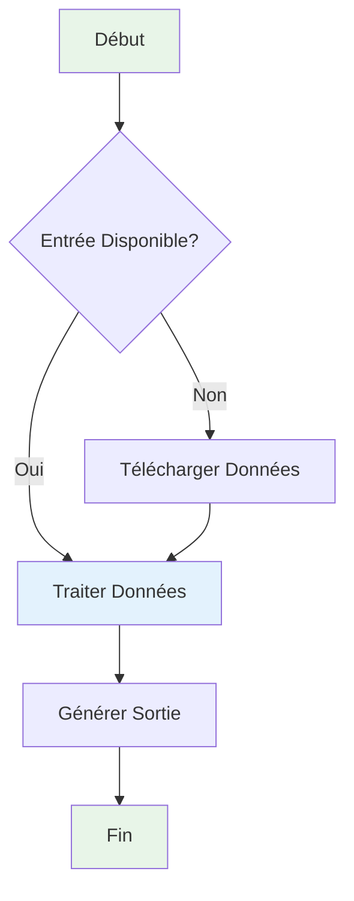
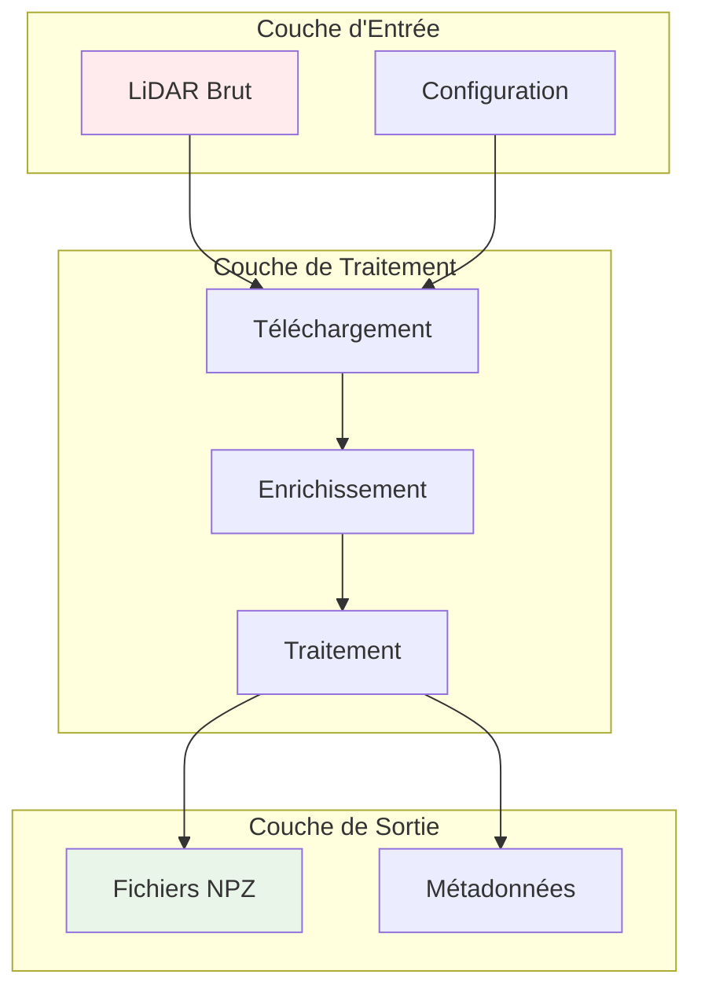
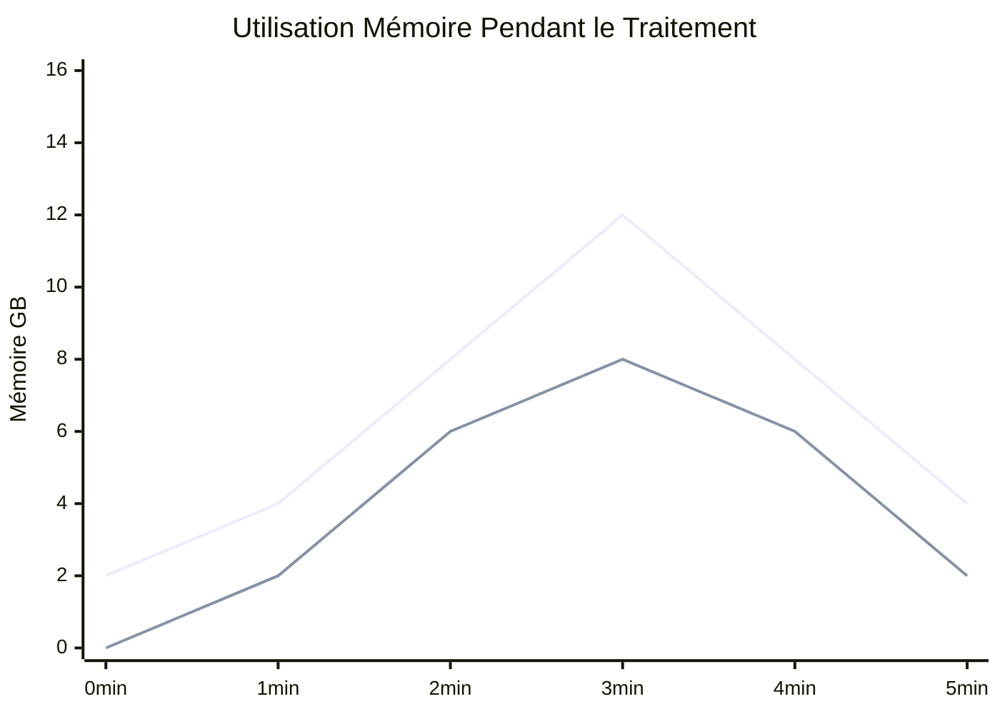
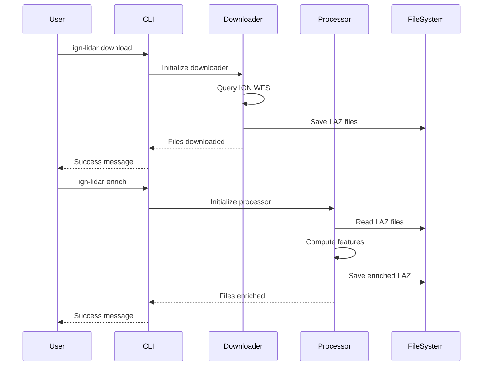
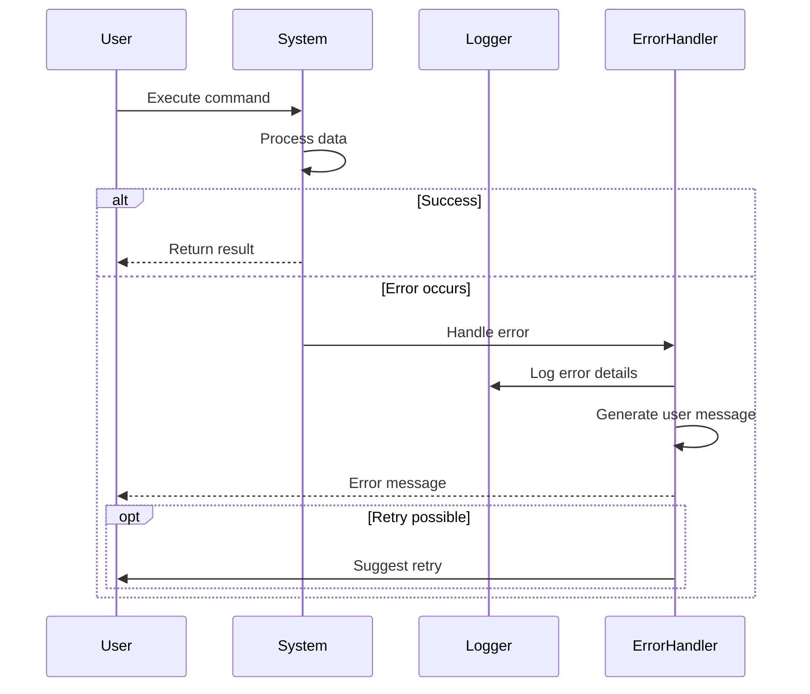
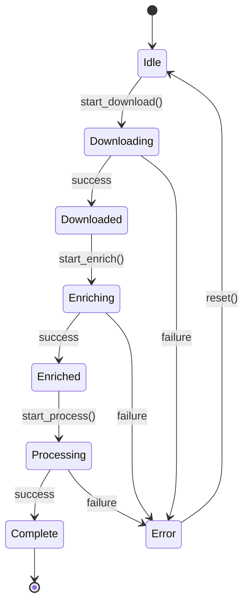
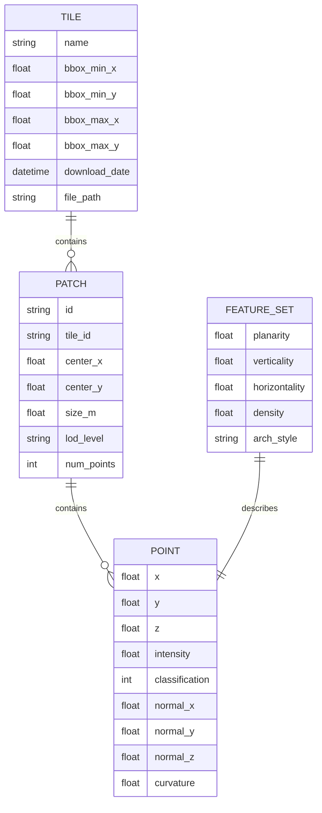
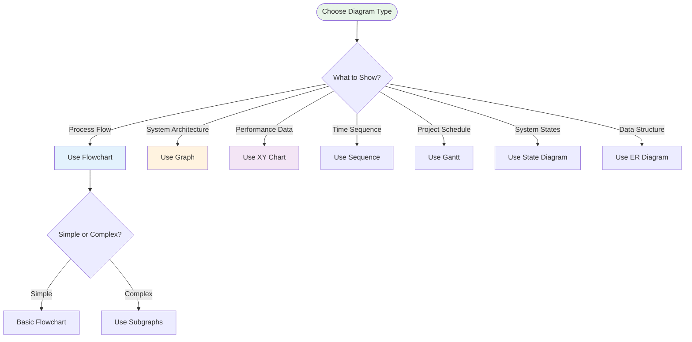

# Référence des Diagrammes Mermaid

Cette page démontre les différents diagrammes Mermaid utilisés dans la documentation IGN LiDAR HD pour visualiser les workflows, architectures et processus.

## 🔄 Diagrammes de Workflow

### Flux de Traitement de Base



### Pipeline Complexe



## 📊 Graphiques de Performance

### Comparaison de Vitesse de Traitement

```mermaid
xychart-beta
    title "Performance de Traitement par Matériel"
    x-axis [CPU-4cœurs, CPU-8cœurs, CPU-16cœurs, GPU-RTX3080, GPU-RTX4090]
    y-axis "Dalles par Heure" 0 --> 100
    bar "Petites Dalles" [8, 15, 25, 60, 85]
    bar "Grandes Dalles" [3, 6, 10, 25, 40]
```

### Utilisation Mémoire dans le Temps



## 🔀 Sequence Diagrams

### CLI Command Flow



### Error Handling Flow



## 📈 Gantt Charts

### Project Timeline

```mermaid
gantt
    title IGN LiDAR Processing Timeline
    dateFormat X
    axisFormat %s

    section Download
    Tile Discovery   :0, 30
    File Download    :20, 120
    Validation      :100, 140

    section Enrichment
    Feature Setup   :120, 150
    GPU Processing  :140, 300
    LAZ Generation  :280, 320

    section ML Preparation
    Patch Extract   :300, 400
    Augmentation    :380, 420
    Dataset Ready   :420, 450
```



### Resource Utilization

```mermaid
gantt
    title System Resource Usage
    dateFormat X
    axisFormat %s

    section CPU Usage
    Preprocessing :0, 60
    Feature Calc  :40, 200
    Postprocess   :180, 240

    section GPU Usage
    Memory Alloc  :60, 80
    Computation   :80, 180
    Memory Free   :180, 200

    section Disk I/O
    Read Input    :0, 40
    Write Temp    :40, 160
    Write Output  :160, 240
```



## 🌐 State Diagrams

### Processing States



### Configuration States

```mermaid
stateDiagram-v2
    [*] --> Default
    Default --> CPU_Mode : set_cpu()
    Default --> GPU_Mode : set_gpu()
    CPU_Mode --> Multi_Worker : add_workers()
    GPU_Mode --> GPU_Optimized : optimize()
    Multi_Worker --> Processing
    GPU_Optimized --> Processing
    Processing --> [*] : complete
```

## 🔧 Entity Relationship Diagrams

### Data Model



## 💡 Usage Tips

### Diagram Selection Guide



### Directives de Palette de Couleurs

- 🟢 **Succès/Complétion** : `fill:#e8f5e8`
- 🔵 **Traitement/Actif** : `fill:#e3f2fd`
- 🟡 **Avertissement/Attention** : `fill:#fff3e0`
- 🟣 **Configuration** : `fill:#f3e5f5`
- 🔴 **Erreur/Problème** : `fill:#ffebee`

### Bonnes Pratiques

1. **Gardez les diagrammes ciblés** - Un concept par diagramme
2. **Utilisez un style cohérent** - Mêmes couleurs pour éléments similaires
3. **Ajoutez des étiquettes significatives** - Texte clair et descriptif
4. **Optimisez pour la lisibilité** - Pas trop encombré
5. **Mettez à jour régulièrement** - Gardez les diagrammes à jour avec les changements de code
