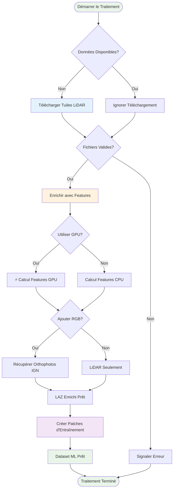
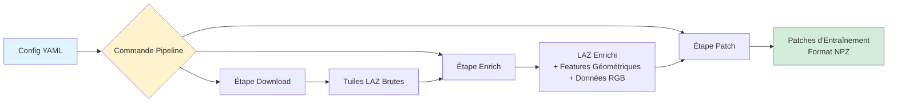
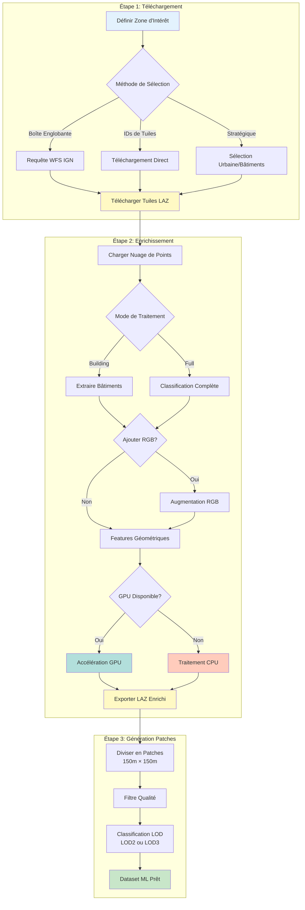
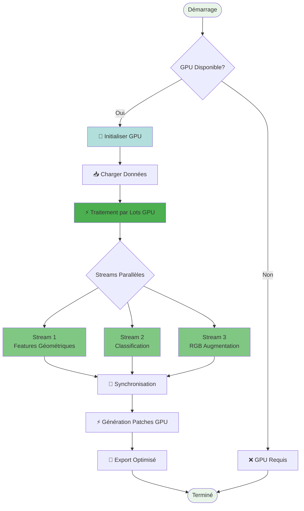
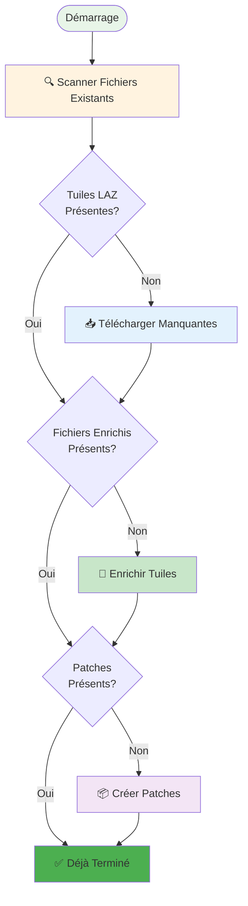
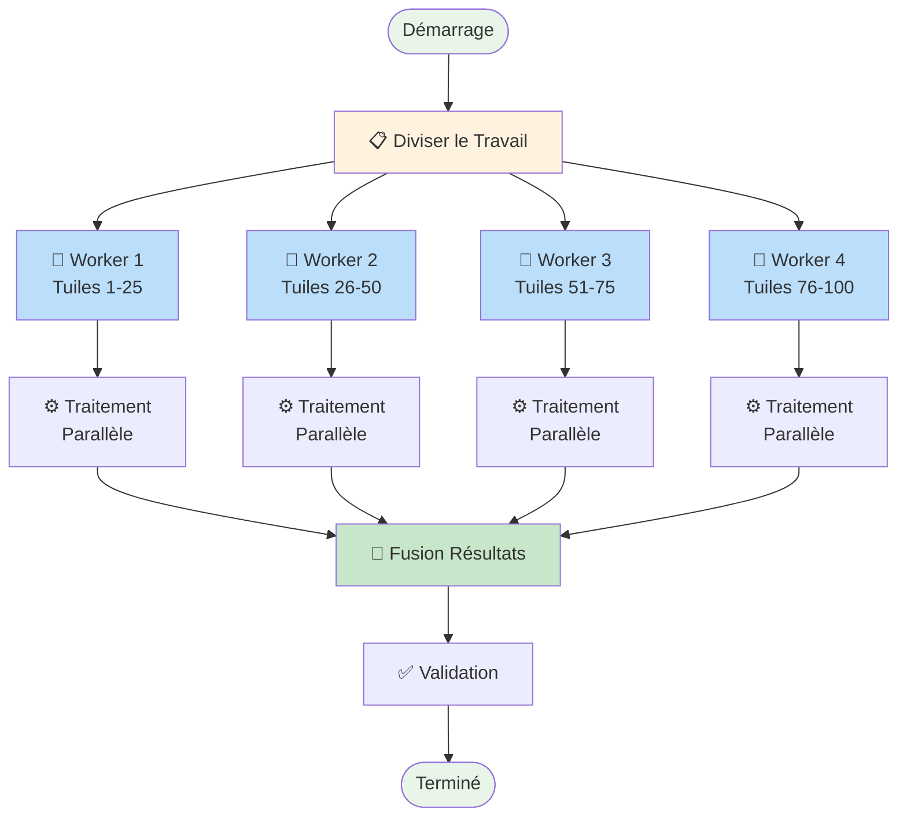

# Diagrammes de Workflows

Cette page contient des diagrammes de workflows réutilisables qui sont référencés à travers plusieurs pages de documentation.

## Pipeline de Traitement de Base

## Architecture Pipeline

## Workflow à Trois Étapes

## Workflow GPU Accéléré

## Workflow de Reprise Intelligente

## Workflow de Traitement Parallèle

