# Diagrammes de Workflows

Cette page contient des diagrammes de workflows réutilisables qui sont référencés à travers plusieurs pages de documentation.

## Pipeline de Traitement de Base

```mermaid
flowchart TD
    Start([Démarrer le Traitement]) --> Check{Données Disponibles?}
    Check -->|Non| Download[Télécharger Tuiles LiDAR]
    Check -->|Oui| Skip1[Ignorer Téléchargement]

    Download --> Validate{Fichiers Valides?}
    Skip1 --> Validate
    Validate -->|Non| Error1[Signaler Erreur]
    Validate -->|Oui| Enrich[Enrichir avec Features]

    Enrich --> GPU{Utiliser GPU?}
    GPU -->|Oui| GPU_Process[⚡ Calcul Features GPU]
    GPU -->|Non| CPU_Process[Calcul Features CPU]

    GPU_Process --> RGB{Ajouter RGB?}
    CPU_Process --> RGB

    RGB -->|Oui| FetchRGB[Récupérer Orthophotos IGN]
    RGB -->|Non| SkipRGB[LiDAR Seulement]

    FetchRGB --> Features[LAZ Enrichi Prêt]
    SkipRGB --> Features

    Features --> Process[Créer Patches d'Entraînement]
    Process --> Output[Dataset ML Prêt]
    Output --> End([Traitement Terminé])

    Error1 --> End

    style Start fill:#e8f5e8
    style End fill:#e8f5e8
    style Download fill:#e3f2fd
    style Enrich fill:#fff3e0
    style Process fill:#f3e5f5
    style Output fill:#e8f5e8
```

## Architecture Pipeline

```mermaid
graph LR
    A[Config YAML] --> B{Commande Pipeline}
    B --> C[Étape Download]
    B --> D[Étape Enrich]
    B --> E[Étape Patch]
    C --> F[Tuiles LAZ Brutes]
    F --> D
    D --> G[LAZ Enrichi<br/>+ Features Géométriques<br/>+ Données RGB]
    G --> E
    E --> H[Patches d'Entraînement<br/>Format NPZ]

    style A fill:#e1f5ff
    style B fill:#fff3cd
    style H fill:#d4edda
```

## Workflow à Trois Étapes

```mermaid
flowchart TD
    subgraph "Étape 1: Téléchargement"
        A[Définir Zone d'Intérêt] --> B{Méthode de Sélection}
        B -->|Boîte Englobante| C[Requête WFS IGN]
        B -->|IDs de Tuiles| D[Téléchargement Direct]
        B -->|Stratégique| E[Sélection Urbaine/Bâtiments]
        C --> F[Télécharger Tuiles LAZ]
        D --> F
        E --> F
    end

    subgraph "Étape 2: Enrichissement"
        F --> G[Charger Nuage de Points]
        G --> H{Mode de Traitement}
        H -->|Building| I[Extraire Bâtiments]
        H -->|Full| J[Classification Complète]
        I --> K{Ajouter RGB?}
        J --> K
        K -->|Oui| L[Augmentation RGB]
        K -->|Non| M[Features Géométriques]
        L --> M
        M --> N{GPU Disponible?}
        N -->|Oui| O[Accélération GPU]
        N -->|Non| P[Traitement CPU]
        O --> Q[Exporter LAZ Enrichi]
        P --> Q
    end

    subgraph "Étape 3: Génération Patches"
        Q --> R[Diviser en Patches<br/>150m × 150m]
        R --> U[Filtre Qualité]
        U --> V[Classification LOD<br/>LOD2 ou LOD3]
        V --> W[Dataset ML Prêt]
    end

    style A fill:#e3f2fd
    style F fill:#fff9c4
    style Q fill:#fff9c4
    style W fill:#c8e6c9
    style O fill:#b2dfdb
    style P fill:#ffccbc
```

## Workflow GPU Accéléré

```mermaid
flowchart TD
    Start([Démarrage]) --> CheckGPU{GPU Disponible?}
    CheckGPU -->|Non| Error[❌ GPU Requis]
    CheckGPU -->|Oui| InitGPU[🚀 Initialiser GPU]

    InitGPU --> LoadData[📥 Charger Données]
    LoadData --> BatchProcess[⚡ Traitement par Lots GPU]

    BatchProcess --> ParallelStreams{Streams Parallèles}
    ParallelStreams --> Stream1[Stream 1<br/>Features Géométriques]
    ParallelStreams --> Stream2[Stream 2<br/>Classification]
    ParallelStreams --> Stream3[Stream 3<br/>RGB Augmentation]

    Stream1 --> Sync[🔄 Synchronisation]
    Stream2 --> Sync
    Stream3 --> Sync

    Sync --> GPUPatches[⚡ Génération Patches GPU]
    GPUPatches --> Export[💾 Export Optimisé]
    Export --> End([Terminé])

    Error --> End

    style Start fill:#e8f5e8
    style InitGPU fill:#b2dfdb
    style BatchProcess fill:#4caf50
    style Stream1 fill:#81c784
    style Stream2 fill:#81c784
    style Stream3 fill:#81c784
    style End fill:#e8f5e8
```

## Workflow de Reprise Intelligente

```mermaid
flowchart TD
    Start([Démarrage]) --> ScanFiles[🔍 Scanner Fichiers Existants]
    ScanFiles --> CheckDownload{Tuiles LAZ<br/>Présentes?}

    CheckDownload -->|Non| Download[📥 Télécharger Manquantes]
    CheckDownload -->|Oui| CheckEnrich{Fichiers Enrichis<br/>Présents?}

    Download --> CheckEnrich
    CheckEnrich -->|Non| Enrich[🔧 Enrichir Tuiles]
    CheckEnrich -->|Oui| CheckPatches{Patches<br/>Présents?}

    Enrich --> CheckPatches
    CheckPatches -->|Non| CreatePatches[📦 Créer Patches]
    CheckPatches -->|Oui| Complete[✅ Déjà Terminé]

    CreatePatches --> Complete

    style Start fill:#e8f5e8
    style ScanFiles fill:#fff3e0
    style Download fill:#e3f2fd
    style Enrich fill:#c8e6c9
    style CreatePatches fill:#f3e5f5
    style Complete fill:#4caf50
```

## Workflow de Traitement Parallèle

```mermaid
flowchart TD
    Start([Démarrage]) --> SplitWork[📋 Diviser le Travail]

    SplitWork --> Worker1[👷 Worker 1<br/>Tuiles 1-25]
    SplitWork --> Worker2[👷 Worker 2<br/>Tuiles 26-50]
    SplitWork --> Worker3[👷 Worker 3<br/>Tuiles 51-75]
    SplitWork --> Worker4[👷 Worker 4<br/>Tuiles 76-100]

    Worker1 --> Process1[⚙️ Traitement<br/>Parallèle]
    Worker2 --> Process2[⚙️ Traitement<br/>Parallèle]
    Worker3 --> Process3[⚙️ Traitement<br/>Parallèle]
    Worker4 --> Process4[⚙️ Traitement<br/>Parallèle]

    Process1 --> Merge[🔄 Fusion Résultats]
    Process2 --> Merge
    Process3 --> Merge
    Process4 --> Merge

    Merge --> Validate[✅ Validation]
    Validate --> End([Terminé])

    style Start fill:#e8f5e8
    style SplitWork fill:#fff3e0
    style Worker1 fill:#bbdefb
    style Worker2 fill:#bbdefb
    style Worker3 fill:#bbdefb
    style Worker4 fill:#bbdefb
    style Merge fill:#c8e6c9
    style End fill:#e8f5e8
```

