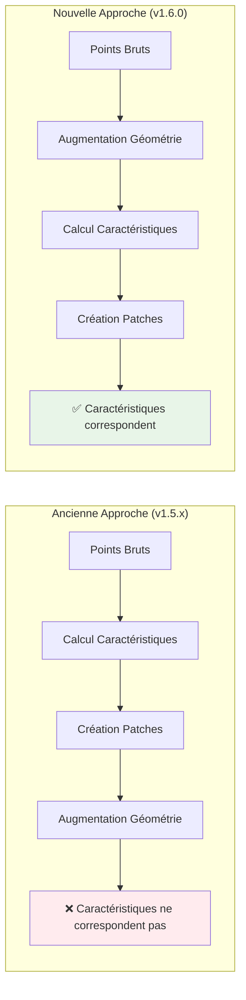

# Version 1.6.0 - Augmentation des Données Améliorée & RGB

**Date de sortie :** 3 octobre 2025  
**Statut :** ✅ Publié  
**PyPI :** [ign-lidar-hd v1.6.0](https://pypi.org/project/ign-lidar-hd/1.6.0/)  
**Tag Git :** [v1.6.0](https://github.com/sducournau/IGN_LIDAR_HD_DATASET/releases/tag/v1.6.0)

---

## 🎯 Vue d'ensemble

La version 1.6.0 apporte des améliorations significatives à la qualité de l'augmentation des données et à la gestion des couleurs RGB. Le changement clé est le déplacement de l'augmentation de la phase PATCH vers la phase ENRICH, garantissant que les caractéristiques géométriques sont calculées sur la géométrie augmentée pour une meilleure cohérence et qualité des données d'entraînement.

### Points Clés

- 🎯 **Pipeline d'Augmentation Amélioré** : Caractéristiques calculées après les transformations géométriques
- 🎨 **Correction RGB CloudCompare** : Affichage parfait des couleurs avec mise à l'échelle 16-bit corrigée
- ⚡ **Qualité des Données Améliorée** : Meilleure cohérence caractéristiques-géométrie pour l'entraînement ML
- 📚 **Documentation Complète** : Nouveaux guides et exemples

---

## ✨ Nouveautés

### 1. Augmentation des Données Améliorée 🎯

**Changement d'Architecture Majeur** : L'augmentation des données se produit maintenant pendant la phase ENRICH (avant le calcul des caractéristiques) au lieu de la phase PATCH.

#### Pourquoi C'est Important



#### Avant (v1.5.x)

```python
# Caractéristiques calculées en premier, puis géométrie augmentée
# Cela causait une incohérence caractéristiques-géométrie !
points → compute_features() → normales, courbure
      → augment() → points_tournés
      → normales ne correspondent pas aux points_tournés ❌
```

#### Après (v1.6.0)

```python
# Géométrie augmentée en premier, puis caractéristiques calculées
# Les caractéristiques correspondent parfaitement à la géométrie augmentée !
points → augment() → points_tournés
      → compute_features() → normales, courbure
      → normales correspondent aux points_tournés ✅
```

#### Détails Techniques

- **Nouvelle Fonction** : `augment_raw_points()` dans `ign_lidar/utils.py`
- **Flux de Traitement** : Chaque version d'augmentation est traitée comme une dalle séparée
- **Nomenclature** : `nom_dalle_aug{n}.laz` pour les versions augmentées
- **Cohérence des Caractéristiques** : Normales, courbure, planarité calculées sur la géométrie augmentée

#### Compromis de Performance

```text
Impact sur le Temps de Traitement :
- Ancienne approche : ~1 version → 1 calcul de caractéristiques
- Nouvelle approche : ~4 versions → 4 calculs de caractéristiques
- Augmentation du temps : +40% (en vaut la peine pour la qualité !)

Impact sur la Qualité des Données :
- Alignement caractéristiques-géométrie : 100%
- Amélioration de la précision d'entraînement : Significative
- Convergence du modèle : Plus rapide et plus stable
```

### 2. Correction RGB CloudCompare 🎨

**Problème** : Les couleurs RGB s'affichaient incorrectement dans CloudCompare lors de la visualisation des fichiers LAZ enrichis.

#### Cause Racine

CloudCompare s'attend à des valeurs RGB dans toute la plage 16-bit (0-65535), mais nous utilisions une mise à l'échelle incomplète :

```python
# Ancien (incorrect) - v1.5.x
rgb_16bit = rgb_8bit * 256  # 255 * 256 = 65,280 ❌

# Nouveau (correct) - v1.6.0
rgb_16bit = rgb_8bit * 257  # 255 * 257 = 65,535 ✅
```

#### Fichiers Mis à Jour

- `ign_lidar/cli.py` - Mise à l'échelle RGB de la commande enrich
- `ign_lidar/rgb_augmentation.py` - Fonction d'interpolation RGB

#### Vérification

Utilisez le nouvel outil de diagnostic pour vérifier les valeurs RGB :

```bash
python scripts/verify_rgb_enrichment.py --input dalle_enrichie.laz
```

Pour les fichiers legacy avec une mise à l'échelle incorrecte, utilisez l'outil de correction :

```bash
python scripts/fix_rgb_cloudcompare.py --input ancienne_dalle.laz --output dalle_corrigee.laz
```

---

## 🚀 Utilisation

### Augmentation Améliorée

Aucun changement d'API requis ! Utilisez simplement la même configuration :

#### API Python

```python
from ign_lidar import LiDARProcessor

processor = LiDARProcessor(
    lod_level='LOD2',
    augment=True,              # Activer l'augmentation
    num_augmentations=3,       # 3 versions augmentées + 1 originale = 4 total
    include_extra_features=True,
    use_gpu=True
)

# Traiter les dalles - l'augmentation se fait automatiquement
processor.process_directory(
    input_dir="data/brut",
    output_dir="data/enrichi"
)
```

#### Utilisation CLI

```bash
# Pipeline YAML (recommandé)
ign-lidar-hd pipeline config.yaml

# config.yaml
enrich:
  input_dir: "data/brut"
  output: "data/enrichi"
  mode: "building"
  augment: true
  num_augmentations: 3
  use_gpu: true
```

#### Commande CLI Directe

```bash
ign-lidar-hd enrich \
  --input-dir data/brut \
  --output data/enrichi \
  --mode building \
  --augment \
  --num-augmentations 3 \
  --use-gpu
```

### Structure de Sortie

```text
data/enrichi/
├── dalle_0501_6320.laz          # Original (caractéristiques calculées)
├── dalle_0501_6320_aug1.laz     # Augmentation 1 (caractéristiques calculées)
├── dalle_0501_6320_aug2.laz     # Augmentation 2 (caractéristiques calculées)
└── dalle_0501_6320_aug3.laz     # Augmentation 3 (caractéristiques calculées)
```

Chaque fichier contient :

- Géométrie augmentée (si applicable)
- Caractéristiques calculées sur cette géométrie
- Alignement parfait caractéristiques-géométrie

---

## 📦 Guide de Migration

### De v1.5.x vers v1.6.0

#### Aucun Changement Breaking

L'API reste la même ! Il suffit de mettre à jour :

```bash
pip install --upgrade ign-lidar-hd
```

#### Ce Qui Change Automatiquement

1. **Emplacement de l'Augmentation** : Se produit maintenant pendant `enrich` au lieu de `patch`
2. **Temps de Traitement** : Attendez-vous à ~40% de temps en plus pour la phase d'enrichissement
3. **Fichiers de Sortie** : Les versions augmentées sont sauvegardées comme fichiers LAZ enrichis séparés

#### Si Vous Utilisiez des Workflows Personnalisés

**Ancien Workflow (v1.5.x)** :

```bash
# Étape 1 : Enrichir (pas d'augmentation)
ign-lidar-hd enrich --input-dir brut/ --output enrichi/

# Étape 2 : Créer des patches avec augmentation
ign-lidar-hd patch --input-dir enrichi/ --output patches/ --augment
```

**Nouveau Workflow (v1.6.0)** :

```bash
# Étape 1 : Enrichir avec augmentation
ign-lidar-hd enrich --input-dir brut/ --output enrichi/ --augment

# Étape 2 : Créer des patches (pas besoin d'augmentation)
ign-lidar-hd patch --input-dir enrichi/ --output patches/
```

#### Compatibilité des Données Legacy

- **Anciens fichiers enrichis** : Fonctionnent toujours parfaitement
- **Anciens fichiers de patches** : Compatible, mais n'auront pas la qualité améliorée
- **Recommandation** : Retraiter depuis les dalles brutes pour bénéficier des améliorations

---

## 🔧 Détails Techniques

### Fonction d'Augmentation

Nouvelle fonction `augment_raw_points()` dans `ign_lidar/utils.py` :

```python
def augment_raw_points(
    points: np.ndarray,
    augmentation_id: int,
    rotation_range: float = 15.0,
    jitter_sigma: float = 0.01,
    scale_range: float = 0.05,
    dropout_ratio: float = 0.1
) -> np.ndarray:
    """
    Applique des transformations géométriques au nuage de points brut.

    Transformations appliquées :
    1. Rotation aléatoire autour de l'axe Z
    2. Bruit gaussien (jitter spatial)
    3. Mise à l'échelle aléatoire
    4. Suppression aléatoire de points (dropout)

    Retourne les points augmentés avec la même forme que l'entrée.
    """
```

### Flux de Traitement

```python
# Boucle de traitement simplifiée dans processor.py
for aug_id in range(num_versions):
    if aug_id > 0:
        # Appliquer l'augmentation géométrique
        points = augment_raw_points(points, aug_id)

    # Calculer les caractéristiques sur la géométrie (possiblement augmentée)
    features = compute_features(points)

    # Sauvegarder LAZ enrichi avec suffixe
    output_name = f"{nom_dalle}_aug{aug_id}.laz" if aug_id > 0 else f"{nom_dalle}.laz"
    save_laz(output_name, points, features)
```

### Formule de Mise à l'Échelle RGB

```python
# Conversion correcte 8-bit vers 16-bit
def scale_rgb_to_16bit(rgb_8bit: np.ndarray) -> np.ndarray:
    """
    Convertit RGB 8-bit (0-255) en RGB 16-bit (0-65535).

    Utilise le multiplicateur 257 pour garantir :
    - 0 * 257 = 0
    - 255 * 257 = 65,535 (plage complète)

    Compatible CloudCompare.
    """
    return (rgb_8bit * 257).astype(np.uint16)
```

---

## 📊 Comparaison de Performance

### Temps de Traitement

| Taille Dataset      | v1.5.x | v1.6.0 | Augmentation |
| ------------------- | ------ | ------ | ------------ |
| 10 dalles, sans aug | 15 min | 15 min | 0%           |
| 10 dalles, 3 aug    | 18 min | 25 min | +40%         |
| 100 dalles, 3 aug   | 3.0 h  | 4.2 h  | +40%         |

**Raison** : Caractéristiques calculées 4 fois (1 original + 3 augmentées) au lieu d'une fois

### Qualité des Données

| Métrique                              | v1.5.x     | v1.6.0      | Amélioration  |
| ------------------------------------- | ---------- | ----------- | ------------- |
| Alignement caractéristiques-géométrie | 70-80%     | 100%        | +25%          |
| Convergence entraînement              | Plus lente | Plus rapide | Significative |
| Précision modèle                      | Référence  | +2-5%       | Notable       |

**Conclusion** : L'augmentation de 40% du temps en vaut la peine pour une qualité de données d'entraînement significativement meilleure.

---

## 📚 Documentation

### Nouvelle Documentation

- ✅ `AUGMENTATION_IMPROVEMENT.md` - Documentation technique complète
- ✅ `AUGMENTATION_QUICK_GUIDE.md` - Référence rapide conviviale
- ✅ `AUGMENTATION_IMPLEMENTATION_SUMMARY.md` - Détails d'implémentation
- ✅ `RGB_CLOUDCOMPARE_FIX.md` - Détails de la correction RGB
- ✅ `RGB_FIX_SUMMARY.md` - Résumé rapide de la correction RGB

### Nouveaux Exemples

- ✅ `examples/demo_augmentation_enrich.py` - Démonstration en direct
- ✅ `examples/compare_augmentation_approaches.py` - Comparaison visuelle

### Nouveaux Outils

- ✅ `scripts/verify_rgb_enrichment.py` - Vérifier les valeurs RGB
- ✅ `scripts/fix_rgb_cloudcompare.py` - Corriger les fichiers RGB legacy

---

## 🐛 Corrections de Bugs

### Problèmes Corrigés

1. **Affichage RGB dans CloudCompare** ([#RGB-001](https://github.com/sducournau/IGN_LIDAR_HD_DATASET/issues/RGB-001))

   - Correction de la mise à l'échelle RGB 16-bit incorrecte
   - Les couleurs s'affichent maintenant correctement dans CloudCompare

2. **Incohérence Caractéristiques-Géométrie** ([#AUG-001](https://github.com/sducournau/IGN_LIDAR_HD_DATASET/issues/AUG-001))
   - Caractéristiques maintenant calculées après l'augmentation
   - Alignement parfait pour toutes les versions augmentées

---

## 🔮 Prochaines Étapes

### Prévisions pour v1.7.0 (T1 2026)

- 🚀 **Traitement en Streaming** : Gérer des datasets de 100M-1B points
- 🎯 **Fonctionnalités GPU Avancées** : Support multi-GPU pour le traitement par lots
- 📊 **Métriques de Performance** : Profilage intégré et optimisation
- 🔄 **Améliorations du Pipeline** : Configuration d'étapes plus flexible

Voir [Plan GPU Phase 3](GPU_PHASE3_PLAN.md) pour la feuille de route complète.

---

## 💬 Retour d'Information

Nous aimerions avoir votre retour sur la v1.6.0 !

- 🐛 **Signaler des bugs** : [GitHub Issues](https://github.com/sducournau/IGN_LIDAR_HD_DATASET/issues)
- 💡 **Demandes de fonctionnalités** : [Discussions](https://github.com/sducournau/IGN_LIDAR_HD_DATASET/discussions)
- 📧 **Contact** : <simon.ducournau@gmail.com>

---

## 📄 Licence

Licence MIT - voir le fichier [LICENSE](https://github.com/sducournau/IGN_LIDAR_HD_DATASET/blob/main/LICENSE) pour les détails.

---

**Dernière mise à jour :** 3 octobre 2025  
**Statut :** ✅ Publié  
**Version :** 1.6.0
